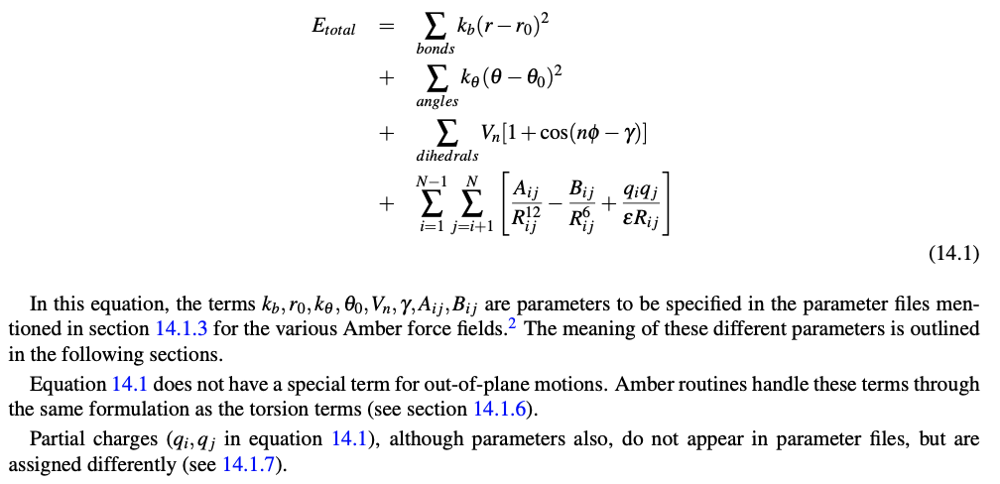

=============================
Classical Molecular Dynamics
=============================

.. contents::
    :local:

Classical Molecular Dynamics (MD) is a simulation technique that makes use of simplifying assumptions about the motions of molecular systems by using Newtonian mechanics.

Understanding the Basics
------------------------

**Force Field**
	An empirical potential energy function. If we know the forces acting in a system, we can calculate how particle positions will change with time using Newton's classical laws of motion. In order to calculate the forces $\vec F$ of each particle, we must have a functional description of the potential energy, U, as a function of coordinate space, r.

.. math:: 
    \vec F = -\vec\nabla U(r)

**Standard Forces**

	For each timestep in the simulation, the force on every atom is calculated. This is the most time-consuming component of the calculation.

	Interatomic forces:

		1. Coulombic potential (attractive or repulsive, :math:`\propto r^{-1}`)

		2. Van der Waals (attractive, :math:`\propto r^{-6}`)

		3. Electronic (repulsive, :math:`\propto r^{-12}`)

**Integration of Newton's Laws of Motion**

	Explaining how velocities and positions are stored at different offset steps and updated accordingly.
	Algorithm for integrating Newton's laws of motion.

**Stochastic Thermostats**
    Thermostats maintain a constant temperature simulation. The system is coupled to a heat bath that imposes the desired temperature. With stochastic thermostats, this is done by introducing stochastic (random), occasional forces (collisions) on randomly selected particles. The collisions are implemented to ensure the system's energy is appropriately distributed (according to a Boltzmann average). Common examples include the Andersen and Langevin thermostats. 
    
**Barostats**
    Many experiments are performed under constant pressure, rather than constant volume, so it's very common to perform MD simulations with a constant pressure ensemble (i.e., NPT). One of the most common is the Monte Carlo Barostat.
    
**Periodic Boundary Conditions**
    Space is "infinite" tiled repeats of simulation box

Step 1: Prepare System
----------------------

1. Find/construct initial structure of your system 
    Once you know what system you want to simulate, the easiest way to set up the system is to find a crystal structure representative of the system you are interested in. 
    
    The Protein Data Bank is a database with collections of crystal structures: https://www.rcsb.org

    You will want your initial structure file to be in the pdb format: https://www.cgl.ucsf.edu/chimera/docs/UsersGuide/tutorials/pdbintro.html

    Things to consider:
        1.1) Do you want to simulate a system that has a ligand bound or unbound? If you have a ligand you will need to include additional force field parameters in following steps. A number of small organic molecules have been previously parameterized, so you will have to see if that is the case for your ligand. If it is not, you will need to develop the parameters. There are numerous methods to do this, most common is probably the RESP (C. I. Bayly et. al. J. Phys. Chem. 97, 10269 (1993)) procedure. Either way, if you parameterize something you should include that information in your SI!!! 
    
    
            - if you are keeping a ligand, you should save the ligand coordinates in SDF format, and delete it from the PDB file. At this point you need to separate protein and non-protein molecules (except ions and water) because they will get different treatment in later steps. 
    
    

        1.2) Is there a mutation in the crystal structure? Pretty common. Easy fix, just delete the atoms that are not in the residue you want to be there, and change the three letter residue ID. A program used in later steps will be able to identify there are missing atoms in that residue and place them. 

    
        1.3) Are there missing residues or heavy atoms? Probably, but it is only an issue if there are consecutive missing residues. There are programs that exist to try and predict positions of missing residues if this is the case. https://salilab.org/modeller/tutorial/
    
    
        1.4) Are there ions or cofactors present that you don't want to simulate? Probably. Just remove those lines from the pdb file. 
    
    
        1.5) Do you want to keep crystallographic waters? Probably. 
    

        1.6) Visualize your system (PyMol and VMD are my go-tos). See if anything looks wrong. For example, there should only be 1 of your system. In some crystallizations there are repeating units. Unless you intentially want to simulate repeating units (which you probably don't) delete the lines in the PDB file associated with repeats. 
   
    
        1.7) Add 'TER' lines to the PDB. 'TER' separates parts in the PDB file that are not covalently linked. If you have a dimer protein you should have two TER lines after the carboxylic acid terminal oxygens. You don't need to add TER between water molecules, tleap will do that for you.

    **PRO TIP**: *Always read the paper associated with a crystal structure. The authors will disclose if mutations are present, and provide additional information that may be important to know!* 
    
    2. tLEAP
        This is a program that is used to prepare input for AMBER. Before you do anything with tleap make sure you have adjusted any mutated residues. That way, you won't have to worry about adjusting the hydrogens,just the heavy atoms.
        
        First, protonate your system::
        
            > source leaprc.protein.ff14SB #load in a force field
            > source leaprc.water.tip3p #load in a force field
            > x = loadpdb FILENAME.pdb #load in a structure
            > savepdb x FILENAME_PROTONATED.pdb #saves pdb file with everything protonated
            > quit #exit
            
        Hydrogens are typically unresolved in crystalization methods. This means the original pdb file will not contain positions of hydrogens. Therefore, you must protonate the system. HOWEVER! I like to protonated my system and then load it into a visualization software to evaluate protonation states, specifically of all HIS residues. Histidine's have two nitrogen atoms that can be protonated, and it will depend on the enrivornment which is more likely the be protonated. It is best practice to manually visualize each HIS residue and declare the protonation state.
        
        *Evaluating HIS protonation states:*
        

        
            1. load protonated pdb into PyMol
            2. PyMol> hide nonbonded
            3. PyMol> select "his_residues", resn hie #tleap automated chooses the epsilon N to be protonated
            4. Show his_residues selection as licorice and color by element differently to see easily 
            5. PyMol> show sticks, byres all within 5 of his_residues
            6. display sequence
            7. open pdb file in text editor
            8. start looking at each HIS. If you think the delta N should be protonated, go to that HIS in the pbd and change the HIE to HID for each atom. You also need to delete the HE2 hydrogen atom line. When you load the pdb into tleap again it will detect there needs to be a HD2 atom added, and will do so automatically because you named that residue HID.
            
        Back to tleap::
        
            > source leaprc.protein.ff14SB #load force field 
            > source leaprc.water.TIP3P #load parameters for water 
            > x = loadPdb FILE_WITH_ADJUSTED_HIS_STATES.pdb #load protonated pdb file 
            > solvatebox x TIP3PBOX 12 #Solvate the complex with a cubic water box  
            > savepdb x FILENAME_SOLVATED.pdb #save your pdb with waters so you can determine how many waters  
            > saveamberparm x temp.prmtop temp.rst7 #doing this right now will tell you if your system has a net charge, and the total number of water molecules 
            > addions x Na+ Y #Neutralize system, might replace waters
            
       *Pay attention to any errors when loading in your pdb structure. An error likely means tleap isn't sure how to deal with something. Warnings on the other hand are just things tleap wants to bring attention to, but these likely aren't fatal. At this point, tleap will probaly give you a warning statement about an unperturbed charge of the unit. This means your system has a charge, and you probably want a neutral system. This is best done straight in the command line.*
       
        **Important**: *tleap has a tendency to undervalue the water density. It is typically at a density of ~0.85 g/mL when we know water density should be about 0.998 g/mL. This is an annoying feature of tleap. You should keep this in mind when trying to calculate how many ions you need for a particular ionic concentration. When you are running your simulations you will perform some steps in the NPT ensemble which will allow the box volume to equilibrate, resulting in correct density.*
        
        *If you did the saveamberparm command you will see how many waters your system has. Or you should do the following: In a separate terminal window I use the command "grep -c 'WAT' ~SOMEPATH/FILENAME_SOLVATED.pdb". Divide this number by 3 to get the number of water molecules in your system.*
        
        I have a code that then will determine how many ions you should add::
   
            import numpy as np 
            import sys 
            water_residues = sys.argv[1]
            desired_ionic_conc = sys.argv[2]
            avo = 6.022e23 # molecules/mol 
            water_mm = 18.01528 #g/mol 
            water_conversion = 1e-24/water_mm*avo #molecules of water/A^3 
            water_volume = int(water_residues)/water_conversion #A^3 
            number_of_ions = float(desired_ionic_conc)/1000/1e24*6.022e23*water_volume #molecules
            print('You need to add:',number_of_ions,'ions')
        
        
       To Run:: 
       
          > python code.py #water_molecules desired_ionic_concentration
           
      Now, back in the tleap window:: 
        
          > addions x Na+ XX #However many you need for desired concentration  
          > addions x Cl- XX #However many you need for desired concentration  
          > check x #You will probably get Warning:Close contact.. and that's okay.
          > saveamberparm x FILENAME.prmtop FILENAME.rst7 #Save AMBER topology and coordinate files 
          > savepdb x FILENAME.pdb #save your pdb with ions and waters 
          > quit #exit
          
      *tleap will automatically generate a 'leap.log' file. You should keep this! Why not include in your SI so others can see exactly how you prepared your system! It's a pretty large file though...*
      
      **PRO TIP**: *ALWAYS visualize the system when you think you're all done!*
      
Step 2: Minimization
--------------------

We must minimize our system such that we are starting our simulations in a local energy minimum. The crystal structure probably has some structural artifacts as a result of the procedure. We don't care for that. It is possible that if you start a simulation from the crystal structure your system could immediately blow up due to extreme forceson any one atom, causing the atoms to move an unreasonable amount in a single timestep. Thus, there are minimization algorithms we appy to the system (such as steepest descent). Minimizations are typically done in two steps: 1) water minimization, to allow the solvent to relax around your solute, and 2) system minimization, where you allow the solute to relax.

    **General initial minimization protocol**: min.1.in
    
    ::

      &cntrl 
        imin=1, #flag to start minimization procedure, perform single point energy calc 
        ntx=1, #read positions, but no initial velocity info 
        irest=0, #not restarting from a previous point 
        ntpr=100, #print MD progress every 100 steps
        ntwx=100, #write out coordinates every 100 steps
        ioutfm=1,#format of the output file (trajectory) with coordinate and velocity info. 1 is the flag for a binary  
        NetCDF traj file (it's smaller,has higher precision, and faster to work with.  
        ntb=1, #periodic boundary conditions are imposed for constant volume 
        iwrap=1,
        maxcyc=10000, 
        cut=12.0, 
        ntr=1, #flag for restraining certain atoms
        restraint_wt=75, #restraint force constant in kcal/(mol A**2) 
        restraintmask=":1-454", 
     /
     
     
    To run: 
    
    ::
    
        > AMBERHOME/bin/pmemd.cuda -O -i ../min.1.in -o igps_wt_apo.w_ions_solv.min.1.out 
        -r igps_wt_apo.w_ions_solv.min.1.rst -x igps_wt_apo.w_ions_solv.min.1.mdcrd 
        -c ../igps_wt_apo.w_ions_solv.rst7 -p ../igps_wt_apo.w_ions_solv.prmtop 
        -ref ../igps_wt_apo.w_ions_solv.rst7 -inf igps_wt_apo.w_ions_solv.min.1.mdinfo
     
    **General follow up minimization protocol**: min.2.in
    
    ::

      &cntrl 
          imin=1, 
          ntx=1, 
          irest=0, 
          ntpr=100, 
          ntwx=100, 
          ioutfm=1, 
          ntb=1, 
          iwrap=1,
          maxcyc=10000,
          cut=12.0,
         /
     
    To run: 
    
    ::
    
        > AMBERHOME/bin/pmemd.cuda -O -i ../min.2.in -o igps_wt_apo.w_ions_solv.min.2.out 
        -r igps_wt_apo.w_ions_solv.min.2.rst -x igps_wt_apo.w_ions_solv.min.2.mdcrd 
        -c ../minimization.1/igps_wt_apo.w_ions_solv.min.1.rst -p ../igps_wt_apo.w_ions_solv.prmtop 
        -inf igps_wt_apo.w_ions_solv.min.2.mdinfo  

    **And this is a good point to visualize your system, and make sure it hasn't deviated too much from the initial crystal structure. The way I recommend doing this is in VMD**::
    
        1. Load in your initial PDB (The one you made in tleap)
        2. Load in a PDB from after your minimizations (cpptraj one-liner to generate a pdb from MD coordinates: cpptraj -p topology-file.prmtop -y coordinate-file.coords -x output-file.pdb ) 
        3. In VMD go to Extensions > Analysis > RMSD Calculator > *select a molecule and click Align. 
        4. Now you just want to make sure nothing crazy is happening, like any tertiray or secondary structure issues, for example. 
    
    
Step 3: Heating
--------------------
Now, we must invest some simulation time into unbiasing our system, and getting it to the right thermodynamics properties, such as a particular temperature. 

    **Heating protocol**: heating.in
    
    ::
        Heating from 25 to 303K; NVT for 1 ns;
        &cntrl
          imin=0, 
          ntx=1, 
          irest=0, 
          ntxo=2, 
          ntpr=2500, #print MD progress every 2500 steps 
          ntwr=50000, #restart file written every 50000 steps 
          iwrap=1, 
          ntwx=2500, #write out coordinates every 2500 steps 
          ioutfm=1, 
          nstlim=500000, #number of MD steps 
          dt=0.002, #timestep in picoseconds 
          ntt=3, #thermostat. 3=langevin dynamics flag 
          tempi=25., 
          temp0=303.0, 
          ig=-1, 
          gamma_ln=2 #collision frequency in ps^(-1), variable in Langevin dynamics algorithm 
          ntc=2, 
          ntf=2, 
          ntb=1, 
          cut=12.0, 
          ntr=1, 
          restraint_wt=1, 
          restraintmask=":1-454", 
          nmropt=1, 
         / 
        &wt type='TEMP0', istep1=0,istep2=500000, 
        value1=25.,value2=303. 
        / 
        &wt type='END' 
        / 
    
    To run:
    
    ::
    
        > AMBERHOME/bin/pmemd.cuda -O -i ../heating.in -o igps_wt_apo.w_ions_solv.heating.out 
        -r igps_wt_apo.w_ions_solv.heating.rst -x igps_wt_apo.w_ions_solv.heating.mdcrd 
        -c ../minimization.2/igps_wt_apo.w_ions_solv.min.2.rst -p ../igps_wt_apo.w_ions_solv.prmtop 
        -inf igps_wt_apo.w_ions_solv.heating.mdinfo -ref ../minimization.2/igps_wt_apo.w_ions_solv.min.2.rst

Step 4: Equilibration
---------------------
How do you know if your system is equilibrated? Eh.. you don't ever know... but you can convince yourself it probably is by evaluated properties. For example, if you have an NVT system you can plot volume as a function of timestep and ensure it is fluctuating around the same value with minimal drift. Another common metric, especially for biomolecules, is to examine the root mean squared fluctuations (RMSF) or root mean squared deviations (RMSD) of the residues as a funciton of time. 

    **Equilibration protocol**: equilib.in
    
    ::

        Equilib NVT with constraints for 4 ns; 
        &cntrl 
          imin=0, 
          ntx=5, 
          irest=1, 
          ntxo=2, 
          ntpr=2500, 
          ntwr=50000, 
          iwrap=1, 
          ntwx=2500,  
          ioutfm=1, 
          nstlim=2000000, 
          dt=0.002, 
          ntt=3, 
          temp0=303.0, 
          ig=-1, 
          gamma_ln=2, 
          ntc=2, 
          ntf=2, 
          ntb=1,
          cut=12.0, 
          ntr=1, 
          restraint_wt=1, 
          restraintmask=":1-454", 
         / 

    To run:
    
    ::
    
        > AMBERHOME/bin/pmemd.cuda -O -i -O -i ../equilib.in -o igps_wt_apo.w_ions_solv.equilib.out 
        -r igps_wt_apo.w_ions_solv.equilib.rst -x igps_wt_apo.w_ions_solv.equilib.mdcrd 
        -c ../heating/igps_wt_apo.w_ions_solv.heating.rst -ref ../heating/igps_wt_apo.w_ions_solv.heating.rst 
        -p ../igps_wt_apo.w_ions_solv.prmtop -inf igps_wt_apo.w_ions_solv.equilib.mdinfo

**Pro Tip**: *Prior to production runs, you may need need an additional "equilibration period". For example, if you switch to an NPT ensemble, you will need to allow your box volume to adjust to the density of your system (especially if you use tleap to solvate!). In my personal workflow outlined here I "throw out" the first 250 ns of my production run (the next MD step) which I run in the NPT ensemble. So, essentially those first 250 ns are an additional equilibration period. All the production run trajectory after 250 ns are used for analysis.* 

*Alternatively, if you imposed any restraints during equilibration that are removed in the production run you should account for another period of equilibration.*

**Volume is important to evaluate!**
    *In these input files for my production runs I specify the 'cut' flag to be 12.0. This means my long range electrostatics are calculated up to a 12.0 Å cutoff. The importance of this is that this number MUST be smaller that the longest length of my protein minus the smallest box dimension. Otherwise, there could be artificial physical interactions calculated between periodic images. In the next MD step I explain how I calculate this using VMD. I do this after my equiibration is 'complete' (before the trajectory I actually use for analysis).*

Step 5: Production
------------------
This will be the data collected for analysis! The essential difference between production and equilibration is simply that we plan to analyze the production data. You never want to perform production runs immediately after altering something about your system (temperature, number of molecules, box size, ensemble, etc). If any of that is done you must give your system time to equilibrate. Otherwise, your data will contain artifacts, and thermodynamic property calculations will not hold true because your system was not at equilibrium. It is common practice to discard some initial chunk of production run trajectory to further ensure the data you analyze is of the equilibrated system. The way I have set up my protocol I run equilibration in the NVT ensemble, but the production runs are NPT, which allows the box the relax to the appropriate volume (which is definitely necessary if you solvated with tleap because the water density was low to start with). Because of this, it is absolutely critical that you observe the volume changes after the first few nanoseconds of production run. Specifically, you must ensure that the box volume is still large enough that your system won't start to interact with its periodic images. You must measure along the longest axis of your system, then add your longe-range non-bonded cutoff value specified in your input file to that number. This is the MINIMUM value for your box dimensions. For example, say your sistem is 74 Å, and you use cut=12.0, then your equilibrated box dimensions must all be more than 86 Å. 

Possibly one of the most difficult decisions now is to decide what data to store, and how often to store it. One thing to keep in mind is the time correlation of variables form your simulation. MD observations are time-correlated, therefore it is unneccesary and problematic (in a redundant manner) to store data at each point in time. You must store data in time steps less than the autocorrelation for that specific observable. Alas, we would have no way of knowing the autocorrelation time of a variable until we determine it from simulation, so it is essentially unavoidable to store some redundant data. 

    **Production protocol**: production.in
    
    ::
    
    NPT; no constraints; 10 ns chunks 
    &cntrl  
     imin=0, #no minimization  
     irest=1, #flag to restart simulation, reading positions and velocities from a previous restart file
     ntx=5, #read coordinates and velocities from a previous restart file 
     ntpr=2500, #print MD progress every 2500 steps
     ntwr=5000, #restart file written every 50000 steps 
     ntwx=2500, #write out coordinates every 2500 steps 
     nstlim=5000000, #number of MD steps 
     dt=0.002, #timestep in picoseconds 
     ntt=3, #Langevin dynamics 
     temp0=303.0, 
     ig=-1, 
     gamma_ln=2, 
     ntp=1, #pressure regulation. 1=md with isotropic position scaling
     barostat=2, #Monte Carlo barostat 
     pres0=1.0,#bars 
     ntc=2, #bonds involving H are constrained according to SHAKE  
     ntf=2, #bond interactions with H omitted 
     ntb=2, #periodic boundary conditions are imposed for constant pressure 
     cut=12.0, #nonbonded cutoff in A 
     ioutfm=1,#binary NetCDF trajectory. Binaries are smaller, higher precision, and faster to read and write.
     iwrap=1, #the coordinates written to the rst and trajectory files will be 'wrapped' into a primary box. Has no effect on energy or forces, it's more of a visual thing. This CAN alter diffusion types of acalculations, so in such cases you want = 0. If you are running long trajectories this might be necessary to keep the coordinate output from overflowing the file formats, resulting in huge files.
    /
    
To run:

::
  
    >AMBERHOME/bin/pmemd.cuda -O -i ../Production.in -o 1gpw_holo_wt.prod.prod.out 
    -r 1gpw_holo_wt.prod.prod.rst -x 1gpw_holo_wt.prod.prod.cd 
    -c ../Production_correct_ntwx.prev_prod/1gpw_holo_wt.prod.prev_prod.rst 
    -p ../1gpw_holo_wt.prmtop -inf 1gpw_holo_wt.prod.prod.mdinfo
    
    
    
       
        
        
    
    

