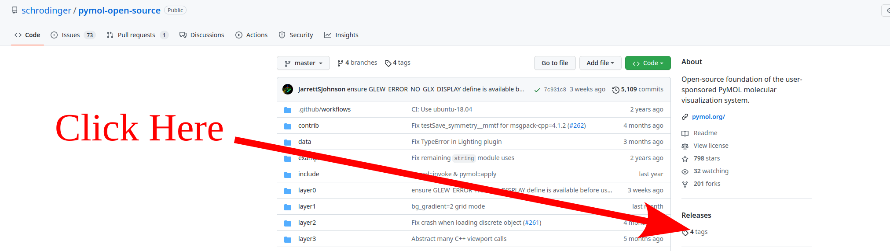

.. |pymol_translation| image:: ./images/pymol_translation.png

.. |pymol_selection| image:: ./images/pymol_selection.png

=====
PyMOL
=====

.. contents::
   :depth: 2
   :local:

Installation
------------

Below are instructions for installing PyMOL on a Linux computer. There 
are also easy instructions to install PyMOL on your personal computer 
`here <https://pymol.org/>`_.

Another thing to note is that the Paton group has a license to use 
PyMOL, so as you set it up you can ask Alex or Jake (Oct 2024) for 
the license file.

Linux
......

We can install two flavors of PyMOL, the "Free for academic use" and the 
"Open source". Here we will see how to set up a new conda environment with the 
appropriate libraries to compile the open source version of PyMOL.

.. note:: 

   For the next steps it will be assumed that you use a UNIX-based OS. 
   If you want to use windows... try to google "stackoverflow create a new 
   conda environment in Windows". 

First we open a new terminal and we create a new conda environment with python 3.8 
and the python requisites:

.. code:: shell

   conda create -n pymol python=3.8

or alternatively (we strongly encourage this one)

.. code:: shell

   conda create -p path/to/venv/pymol python=3.8

After creating the environment we need to activate it. 

.. code:: shell 

   conda activate pymol 

or if you followed the encouraged creation: 

.. code:: shell 

   conda activate path/to/venv/pymol

Next we are going to install some python packages using pip 

.. code:: shell 

   python -m pip install wheel 
   python -m pip install pmw

.. warning:: 

   Be careful :code:`pmw` or in other words :code:`Python MegaWidgets` is not
   the same package as :code:`pwm` or in other words :code:`password manager`.

As pymol is not a pure python program, it does require some external libraries. 
As we might not have admin permissions to install the required libraries and 
programs system-wide we will install them in our conda environment: 

.. code:: shell

   conda install -c anaconda msgpack-python pyqt
   conda install -c conda-forge glew freeglut libxml2 glm libpng hdf5 libnetcdf

.. note:: 

   If you ever want to compile code using gcc, make, cmake, g++, ninja you will
   need to install them in a similar fashion in your conda environment (even if 
   they are already available system-wide, otherwise the compilers will be 
   unable to find the appropriate libraries of the conda environment) 

Now we have the environment ready for compiling pymol. I usually have a folder 
in my home directory named 'compiled_software'. If you want to a different setup
change the appropriate paths. We will create the folders where we will have 
the installation of pymol as well as the source code. 

.. code:: shell

   cd $HOME
   cd compiled_software
   mkdir pymol

Now we download the source code from the 
`pymol github repository <https://github.com/schrodinger/pymol-open-source>`__. 

You can get whichever version you prefer. I do not recommend to download the 
current development code, but instead any of the released versions. 

.. centered:: |pymol_github_00|

Now download your preferred release. Currently the "Free for academic use" 
binary corresponds to the :code:`v2.4.0` version so we will proceed with the 
latest release :code:`v2.5.0`

.. centered:: |pymol_github_01|

Both .zip and .tar.gz correspond to compressed folders, so the next step that we
will do is to uncompress the contents into $HOME/compiled_software/pymol/source 
and then we cd into the folder. 

For zip: 

.. code:: shell 

   unzip $HOME/Downloads/pymol-open-source-2.5.0.zip -d $HOME/compiled_software/pymol
   mv $HOME/compiled_software/pymol/pymol-open-source-2.5.0 $HOME/compiled_software/pymol/source
   cd $HOME/compiled_software/pymol/source

for tar: 

.. code:: shell 

   cd $HOME/compiled_software/pymol
   tar -xvzf $HOME/Downloads/pymol-open-source-2.5.0.tar.gz
   mv pymol-open-source-2.5.0 source
   cd source

Now we proceed to compile pymol

.. code:: shell

   python setup.py install --prefix=$HOME/compiled_software/pymol/installation

Congrats! now you have sucessfully compiled pymol in your conda environment. 
Usually we could just add the path to the pymol binary to our PATH variable and 
we would be prepared. However if we don't have the environment active we will 
see pymol but it will crash inmediatly. What we are going to do is tweak our 
conda environment so that pymol will only be found when we are in this specific 
conda environment. 

First we switch to the base conda environment and move to the folder where the 
files of our environment are.

.. note:: 

   **Yes, here's were you will be grateful of following the advice** of creating 
   the conda environment with the -p beacause it is the same path that you 
   specified. Otherwise the files will be wherever your system hosts the base 
   conda environment... and **you shouldn't** be modifying any of the files of the 
   base environment in loki, falcon, fireball, buzzsaw, acme... **unless you know 
   what you are doing**. 

.. code:: shell 
   
   conda activate
   cd path/to/venv/pymol
   cd etc 

Now we will create a conda folder so that we can have a custom setup of global 
environment variables specific for our conda environment. 

.. code:: shell
   
   mkdir conda
   cd conda
   mkdir activate.d deactivate.d
   touch activate.d/env_vars.sh 
   touch deactivate.d/env_vars.sh 

Use now your favorite text editor to write the following contents in 
`activate.d/env_vars.sh`:  

.. code:: shell

   #!/bin/sh
   
   export MYOLDPATH=${PATH};
   export PATH=${PATH}:${HOME}/compiled_software/pymol/installation/bin;

and in `deactivate.d/env_vars.sh`:  

.. code:: shell

   #!/bin/sh

   export PATH=${MYOLDPATH};
   unset MYOLDPATH;

Finally lets test that you can access pymol in your environment: 

.. code:: shell

   cd $HOME
   conda activate path/to/venv/pymol 
   pymol --help

Pymol Basics
------------

Basic controls
..............

+---------------------------------------+----------------------------------------+
|     .. centered::     Rotation        |     .. centered::    Translate         |
+---------------------------------------+----------------------------------------+
|                                       |                                        |
|     .. centered:: |pymol_rotation|    |     .. centered:: |pymol_translation|  |
+---------------------------------------+----------------------------------------+
|     .. centered::     Zoom            |     .. centered::        Clip          |
+---------------------------------------+----------------------------------------+
|                                       |                                        |
|     .. centered:: |pymol_zoom|        |     .. centered:: |pymol_clip|         |
+---------------------------------------+----------------------------------------+

+---------------------------------------+
|     .. centered::     Selection       |
+---------------------------------------+
|                                       |
|    .. centered:: |pymol_selection|    |
+---------------------------------------+

Basic commands
..............

One of the first commands that we end up requiring when we are using pymol 
is the command :code:`set_name`. Giving names to atom selections allows us to 
more easily change the representations of our molecules but the default name of 
our selection when we use the mouse to select the atoms is *sele*. 

.. centered:: |pymol_command_lines|

We can type commands in any of the pymol command lines, I do recommend using the
top one, since pushing :code:`Esc` in the bottom one will switch the view of our
molecule for a list of commands (We can easily go back by pressing the same button) 

Here we will only need to type the command and the first parameter of the 
command and any second, third or fourth parameter will be separated by a comma. 
In the specific case of :code:`set_name`: 

.. code:: none

   PyMOL> set_name sele, fragment_A

Now we move to another of the most useful command-line commands of pymol, 
:code:`select`. As the name of the command hint it allows to create an atom 
selection from the command line. This can be specially useful when we have a huge
quantity of atoms that we want to select. It is its own conditional language and 
we a more detailed description in the 
`Selection Algebra <https://pymolwiki.org/index.php/Selection_Algebra>`__ section 
of the pymol documentation. 

Now as example we will select the atoms of our molecule that we did not select 
previously and we will name that selection as :code:`fragment_B`. 

.. code:: none

   PyMOL> select fragment_B, all and not fragment_A

Now lets say that we want to visualize :code:`fragment_A` using a VdW spheres 
representation and :code:`fragment_B` using a ball and stick model. We can do 
that with the mouse using the appropriate menus, but let's do it with the 
command line! 

.. code:: none

   PyMOL> show spheres, fragment_A
   PyMOL> preset.ball_and_stick('fragment_B')

Now lets create a new color (which we will call :code:`gurei`) and color everything by atom with the carbons in 
that specific color. 

.. code:: none

   PyMOL> set_color gurey, [0.66,0.66,0.66]
   PyMOL> util.cba('gurey')

.. note:: 

   more information about coloring can be found in the `color <https://pymolwiki.org/index.php/Color>`__ 
   and `Advanced coloring <https://pymolwiki.org/index.php/Advanced_Coloring>`__
   sections of the pymol wiki. 

Now we are going to ray_trace our molecule. Ray-tracing a 3D model involves 
calculating and adding to the final figure the appropriate lighting and shadows
of the 3D model. In other words, making your figure prettier than what it 
usually looks in the normal viewer. 

.. code:: none

   PyMOL> ray

If we use ray by default the dimensions of the figure are going to be dependent 
on our screen and the size of the window where we are visualizing the molecule. 
If we want a higher resolution we have the option of buying a new screen with a 
really high resolution, resizing the window until the limits of our screen, or 
actually spend 30 seconds of our life understanding the syntax of the ray 
command in the `pymol documentation <https://pymolwiki.org/index.php/Ray>`__. 
It's your choice! but as I'm very picky with my figures and you are reading my 
tutorial, lets behave like homo sapiens sapiens for once. We will render a 
figure of 800x600 px (width x height). 

.. code:: none

   PyMOL> ray 800, 600

Great! now let me present to you the ray_trace_mode variable. If we change the 
value of this variable the type of rendering and ray-tracing of our molecule 
will change. It is very well documented in the pymol wiki but feel free to play 
with it a bit. Here's the syntax to change its value and ray-trace afterwards. 

.. code:: none

   PyMOL> set ray_trace_mode, 1
   PyMOL> ray 800, 600

After the ray trace, we can go to the File menu and export the image 
appropriatedly but what fun is it to do it with the mouse when we have arrived 
so far away using the command line? Let's write it instead! 

.. code:: none 

   PyMOL> png my_frankenstein_molecule.png

Hurray! 

PyMOL Scripts and Command Line Rendering
........................................

Our next step in this journey is to translate everything that we did to a python
script. You may wonder why? well I suggest you try to render a protein in cartoon 
mode with a 4000x4000 resolution.

As you curse me in the event that you actually attempted that, now you know why 
sometimes it is very usefull to run pymol without GUI. Especially when your 
group has some fairly powerfull computers (falcon, buzzsaw, fireball, loki...)
**and no one is using them at that moment**

First let's show the syntax to run a python script with pymol through the 
command line without the GUI: 

.. code:: shell

   pymol -c -r path/to/my/python_script.py

Simple right? remember that the it will run in the foreground and as a 
consecuence it will lock your terminal until it finishes. If you want to run it 
in the background: 

.. code:: shell

   pymol -c -r path/to/my/python_script.py &

and if you want to be able to log out of the computer but maintain the process 
running: 

.. code:: shell

   nohup pymol -c -r path/to/my/python_script.py &

And now let's see how a python script that loads a molecule from a file, 
colors it by atom (with 'gurey' carbons) renders and saves it,  looks like: 

.. code:: python 

   from pymol import cmd, stored, util

   ifile = 'mymolecule.xyz' # .pse files can also be loaded

   cmd.load(ifile)

   cmd.do("preset.ball_and_stick('all')")
   carbon_color = [0.666,0.666,0.666]
   cmd.set_color('gurey',carbon_color)
   util.cba('gurey','all')

   width, height = 2751, 2286
   cmd.ray(width,height)
   cmd.png('mymolecule.png')

If you read the previous section, you can probably start tying things together 
and see how, in general, translating from pymol commands to their python 
counterpart can be relatively easy. 

In case I might not have been clear enough regarding how well done the pymol 
documentation is written, let me insist on it. In the following picture we can 
see how beautifully and easily we can find the syntax in pymol as well as the 
syntax in python for the same pymol command with all their parameters explained.

.. centered:: |pymol_wiki_screenshot|

.. note:: 

   You might not believe it, but they happen to have a similar scheme for all 
   their commands in the wiki. I know it's crazy right?? and even with such a 
   wonderfully crafted documentation there is people who would rather enlarge 
   the window to increase the quality of the rendered figure over checking the 
   documentation. People are crazy!

Standard Group Designs 
........................

The Paton group has a general template for creating figures in 
PyMOL. There is a script called ``paton_pymol_style.py`` located 
on the `Theory Suite GitHub <https://github.com/CSU-Theory-Suite/theorysuitescripts/tree/main/pymol>`_.
This script, when called in your ``.pymolrc`` gives you access to 
a lot of the style tools used in the Paton and Kim groups.

To use this script, download the script to your computer and add 
the line 

.. code:: shell

   run /file/location/paton_pymol_style.py

in your ``.pymolrc`` (which you can reach with ``File>Edit pymolrc``).

Additionally, if there are other preset commands you would like to include, 
this is a good place to put them. For example, I have included 

.. code:: shell

   set label_distance_units,2

to ensure that any measurements I make give me the correct number of 
significant figures.