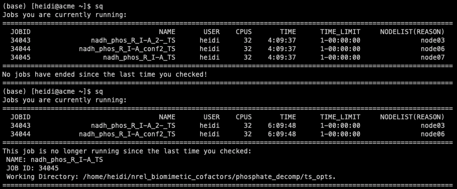

This page is meant to make users aware of helpful packages for our 
research, both in-house and external. Feel free to add any more packages as
you see fit!

=========
GoodVibes
=========

GoodVibes is an in-house Python package from the Paton group designed to compute 
thermochemical values from 
electronic structure frequency calculations. This program allows a user to 
collect energy, enthalpy, entropy, and free energies from quantum chemistry 
output files at variable temperatures and concentrations, while applying a 
variety of useful corrections including quasi-harmonic entropy corrections, 
zero-point energy corrections, and frequency scaling. Other features include 
Boltzmann averaging, relative energy and thermochemistry calculations and 
plotting, and duplicate checking.

Publication is available 
`here <https://doi.org/10.12688/f1000research.22758.1>`__

Documentation can be found in the Readme 
`here <https://github.com/patonlab/GoodVibes>`__

=========
DBSTEP
=========

DFT-Based STEric Parameters (or DBSTEP) is an in-house Python package 
from the Paton group for collecting 
steric parameters from 3D molecular coordinates. Steric parameters available 
include percent buried volume, Sterimol (L, Bmin, Bmax) and new vectorized 
versions of these parameters, vol2vec and Sterimol2vec. This program can be 
used from the command line or in a script to obtain steric values from a 
variety of file formats or RDKit mol objects as input. Optional output allows 
for the visualization of the parameter measurements in PyMOL.

Documentation can be found in the Readme 
`here <https://github.com/patonlab/DBSTEP>`__

=========
REGGAE
=========

REGression Generator and AnalyzEr (or REGGAE) is an in-house R-language script 
from the Paton group for 
statistical analysis of datasets. Statistical diagnostics include linear and 
non-linear regression modeling, feature selection, data splitting, pairwise 
correlations, ANOVA and QSAR analysis, PCA, and cross-validation analysis. 
Users can also generate plots for these analyses.

Documentation can be found in the Readme
`here <https://github.com/Liliana-Gallegos/REGGAE>`__

=========
DISCO
=========

DIStributing Computed Outputs (or DISCO) is an in-house Python script from 
the Paton group used to parse through Gaussisan NBO and GIAO outputs for 
atomistic and molecular properties. DISCO collects NBO atomic charges, NMR 
tensor values, and/or NMR chemical shifts, HOMO, LUMO, and bond distance values.

Documentation can be found in the Readme 
`here <https://github.com/Liliana-Gallegos/DISCO>`_.

=========
AQME
=========

Automated QM Environments (or AQME) is an in-house Python package from 
the Paton group, and is an ensemble of automated QM workflows that can 
be run through Jupyter Notebooks, command lines, and yaml files. 
Workflows include conformational sampling, post-processing of QM output 
files to fix errors, generation of ready-to-run QM files, and generation 
of semi-empirical descriptors in json and csv files (and more).

Publication is available 
`here <https://wires.onlinelibrary.wiley.com/doi/10.1002/wcms.1663>`__

Documentation can be found in the Readme 
`here <https://github.com/jvalegre/aqme>`__

==================
Slurm Job Tracking
==================

An in-house Python script from the Paton group that will allow you to track 
completion of slurm jobs. 
Especially useful if you are running numerous jobs in numerous locations.

To install and use:

* Copy jobcheck.py to machine
    - https://github.com/hklem/slurm_job_tracking
    - You can copy the file anywhere; I chose my home directory.

* (optional) Add alias to your .bashrc >> ``alias sq='python ~/jobcheck.py'``
* Run command
    - When you run for the first time, the script initializes and logs current 
    job information.
    - Note you should run the command everytime after you submit jobs, or else 
    it won't log current job info. 

This is what it looks like when you run the command and a job has ended since 
the last time the command was run:

.. centered:: |running_example|

Now I can quick cd into the directory of the finished job, or copy it 
over to my local machine.

=========
pyssian
=========

:code:`pyssian` is an object oriented library for parsing Gaussian logfiles and input 
files which aims to facilitate the everyday scripting of computational chemists 
using Gaussian.

`Source <https://github.com/maserasgroup-repo/pyssian>`__

`Documentation <https://maserasgroup-repo.github.io/pyssian/>`__

A package containing some useful scripts based on this library that can be used 
as examples of the usage of the library can be found in the :code:`pyssian-utils` 
repository. 

`Source <https://github.com/maserasgroup-repo/pyssian-utils>`__

`Documentation <https://maserasgroup-repo.github.io/pyssian-utils/>`__

=========
RDKit
=========

RDKit is a collection of cheminformatics and machine-learning software written in C++ and Python. It includes BSD license - a business friendly license for open source, Core data structures and algorithms in C++, Python 3.x wrapper generated using Boost.Python, Java and C# wrappers generated with SWIG, 2D and 3D molecular operations, Descriptor and Fingerprint generation for machine learning, Molecular database cartridge for PostgreSQL supporting substructure and similarity searches as well as many descriptor calculators, Cheminformatics nodes for KNIME, and Contrib folder with useful community-contributed software harnessing the power of the RDKit. 

`GitHub <https://github.com/rdkit/rdkit>`_
`Tutorial GitHub <https://github.com/rdkit/rdkit-tutorials>`_

=========
CREST
=========

:code:`CREST` was developed as a program for conformational sampling at the extended tight-binding level GFN-xTB. 
It provides a variety of sampling procedures, for example for improved thermochemistry, or solvation. 
Access the `GitHub <https://github.com/crest-lab/crest>`_.

=========
ROBERT
=========

ROBERT is a Python package designed to help inexperienced researchers 
get started training machine-learning models. It is an ensemble of 
automated machine-learning protocols that can be run sequentially 
through a single command line or graphical user interface. The program 
works for regression and classification problems.

Documentation can be found
`here <https://github.com/jvalegre/robert/tree/master>`_.

Publication can be found 
`here <https://chemrxiv.org/engage/chemrxiv/article-details/65492430c573f893f1ef468d>`_.