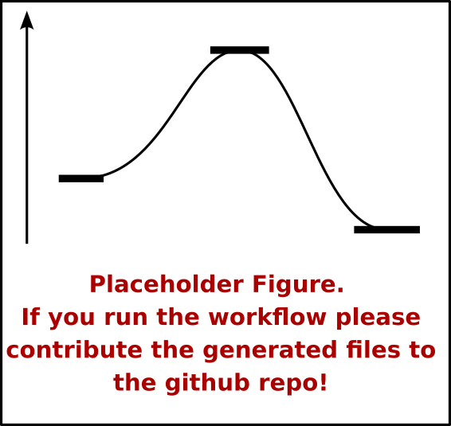

===========================
End-to-End Workflow in ACME
===========================

.. contents::
   :local:

1. Activating the conda environment
------------------------------------

First we start by activating the DL_CPU conda environment. This environment 
is only on ACME and not in the local machines and it is shared between the 
groups. 

.. code:: shell

   conda activate DL_CPU

Activating this conda environment gives us access to the different software/packages 
that we might want to use, such as xTB and AQME. Without this step, the computer 
will behave as though the programs are not installed.

2. Using OpenBabel
------------------

We have previously created a .pdb file with gaussian for the pentene in the 
folder example_workflow in our home folder ( /home/username/ ). Our first step 
of the workflow will be to go to that folder and convert the .pdb file to a .xyz
file that can be read by the xtb software. 

.. code:: shell

   cd example_workflow
   obabel -ipdb pentene.pdb -oxyz -O*.xyz 

Here the :code:`-ipdb` specifies that the format of the input is pdb

3. Running an XTB calculation
-----------------------------

We shouldn't directly run the xtb software because that will make the calculation
not to run in one of the compute node but actually run in the node that controls 
the queue system and keeps everything connected. 

As a consecuence our next step is to prepare the SLURM script to submit the 
calculation to the queue system. Luckily we have available several scripts in 
acme that automate that process. For setting up an xtb calculation we can use 
:code:`xtbsetup.sh`

.. code:: shell

   xtbsetup.sh -i pentene.xyz -c 0 -s ch2cl2

We can also specify the number of processors as well as any extra command line 
options: 

.. code:: shell

   xtbsetup.sh -i pentene.xyz -c 0 -p 1 -a '--opt'

.. note::

   Remember that we can always see how to use a command using either :code:`-h`
   or :code:`--help` i.e. :code:`xtbsetup.sh -h`

the output file will look like: 

.. highlight:: shell

.. literalinclude:: resources/job_xtb.sh

.. highlight:: default

Now we can proceed to submit the calculation to the queue system

.. code::

   sbatch ./job_xtb.sh 

We can check the status of our calculation using the :code:`squeue` command 
which will return us something along the lines of: 

.. highlight:: none

.. literalinclude:: resources/squeue_example.txt

.. highlight:: default

4. Running a CREST calculation
------------------------------

Next, we will perform a conformational search using crest. To submit crest 
calculations we have the :code:`crestsetup.sh` script

.. code:: shell

   crestsetup.sh -i xtbopt.xyz -c 0 -p 32

This will create the file :code:`job_crest.sh` with the contents: 

.. highlight:: shell

.. literalinclude:: resources/job_crest.sh

.. highlight:: default

Now we submit the calculation the same way that we did with the xtb job. 

.. code:: shell

   sbatch job_crest.sh

.. note:: 

   One way that we can follow how the calculation is going is to see the end of the
   log file. for crest calculations this file is :code:`crest.out` and we can use
   the :code:`tail -f crest.out` command to display in the terminal the end of 
   the file. To go back to the usual console, use :code:`ctrl+c`

5. Running a CENSO calculation
------------------------------

Now we are going to prepare a censo calculation. To do so we need to first create
a .censorc file in our home directory. 

.. code:: shell

   cd ..
   touch .censorc

Now we can use our favorite command-line editor to include all the parameters 
that are required for this program to run. For a detailed explanation please go
to :code:`url`. Here we include an example of its contents: 

.. highlight:: none

.. literalinclude:: resources/censorc_file.txt

.. highlight:: default

We are now ready to generate the submit script for our censo calculation using 
:code:`censosetup.sh`

.. code:: shell

   cd example_workflow
   censosetup.sh -i crest_conformers.xyz -c 0 -p 4 -o 8

This will create the file :code:`job_censo.sh` with the contents: 

.. highlight:: shell

.. literalinclude:: resources/job_censo.sh

.. highlight:: default

Now we submit the calculation to the queue system. 

.. code:: shell

   sbatch job_censo.sh 

.. note::

   We can follow the calculation status in the log file :code:`censo.out`

6. Running QM calculations. Gaussian, ORCA, AQME and Goodvibes
--------------------------------------------------------------

After we have generated our conformers using semi-empirical and low cost DFT we 
now proceed to refine them using the DFT method of our choice with Gaussian. To 
do so we will use the in-house developed software :code:`aqme`

.. code:: shell

   python -m aqme --qprep --program gaussian --files enso_ensemble_part2.xyz --qm_input 'm062x def2svp opt freq=noraman' --mem 16GB --nproc 8

This will create a new folder named :code:`QCALC` with our gaussian inputs. 

.. code:: shell

   cd QCALC
   # this command will display the full contents of a file in our terminal
   cat enso_ensemble_part2_conf_6.com

.. highlight:: none

.. literalinclude:: resources/gaussian_example.com

.. highlight:: default

Now to submit all the gausian calculations we have the :code:`gsub`

.. code:: shell

   gsub *.com -n 8 -q normal

.. note:: 
   
   We will be able to follow each one of the calculations progress in 
   their respective .log files.

We now will use another in-house developed software, :code:`goodvibes`, to 
check if we have any imaginary frequencies or duplicate geometries.

.. code:: shell

   python -m goodvibes *.log --imag --dup

Finally we are going to run SP calculations using ORCA. We use :code:`aqme` to 
generate the input files (That have the extension .inp) and proceed to submit them
following the same exact process as with Gaussian calculations

.. code:: shell

   python -m aqme --qprep --program orca --files '*.log' --qm_input 'wb97m-v def2-tzvp' --mem 2GB --nproc 8
   cd QCALC/
   gsub *.inp -n 8 -q normal

.. highlight:: none

.. literalinclude:: resources/orca_example.inp

.. highlight:: default

.. warning:: 

   Be careful of how you write the basis set and functional as sometimes the 
   "spelling" changes across programs and will lead to error terminations. i.e.
   :code:`def2tzvp` is valid for Gaussian but for ORCA :code:`def2-tzvp` is the 
   appropriate "spelling". 

Now, we are going to obtain the thermochemistry of our calculations with the 
single point corrections using :code:`goodvibes`

First we will rename all ORCA calculations so that we can clearly remember that 
they are SP calculations. We can do it with a python script or in a python console: 

.. code:: python

   from pathlib import Path
   files = list(Path.cwd().glob('*.out'))
   # we rename the input and the output files
   for ofile in files:
       ifile = ofile.parent/f'{ofile.stem}.inp'
       ifile.rename(f'{ifile.stem}_sp.inp')
       ofile.rename(f'{ofile.stem}_sp.out')

We can actually do this in a single line: 

.. code:: shell

   python -c "from pathlib import Path; files = list(Path.cwd().glob('*.out')); for ofile in files: ifile = ofile.parent/f'{ofile.stem}.inp'; ifile.rename(f'{ifile.stem}_sp.inp'); ofile.rename(f'{ofile.stem}_sp.out')"

We can do it using bash: 

.. code:: shell

   # It is recommended to run first the following line to ensure that the 
   # renaming is going to work as expected: 
   for item in *.out; do echo $item " -> " ${item%.*}_sp.out; done 

   # After checking that it will do the modifications that we want we proceed to 
   # rename the files: 
   for item in *.out; do mv -v $item ${item%.*}_sp.out; done 
   for item in *.inp; do mv -v $item ${item%.*}_sp.inp; done 

Finally we move all the QM outputs calculations to the same folder and run 
:code:`goodvibes`

.. code:: shell

   # We first rename all the calculations 
   # we first move all calculations to the same place
   mv *.out ../
   cd .. 
   python -m goodvibes *.log --imag --dup --spc sp

The final step of our example workflow is going to include the drawing of the 
Potential Energy Surface (PES). To do so we need a file, :code:`pes.yaml` with 
the following contents: 

.. highlight:: none

.. literalinclude:: resources/pes.yaml

.. highlight:: default

And now we use :code:`goodvibes` to draw the PES. 

.. code:: shell

   python -m goodvibes *.log --imag --dup --spc sp --pes pes.yaml 

|PES|

