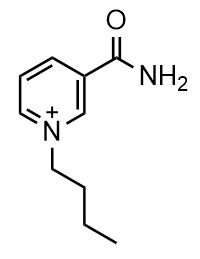

===============================
CENSO
===============================

.. contents::
    :local:

Here is the `CENSO GitHub Page <https://xtb-docs.readthedocs.io/en/latest/CENSO_docs/censo.html#censo>`_.

CENSO is already installed on ACME, you will just need to activate the proper conda environment to access it.

.. code:: shell

    conda activate DL_CPU

This enviornment houses many useful programs such as GoodVibes and CREST as well.

Getting Started
---------------

CENSO is a program designed to help with energetic sorting of structural ensembles, so the first thing that you need to do is generate conformers of a molecule.
If you already have the 3D coordinates of a molecule (most likely .xyz or .sdf), then you can run a conformer search right away.
You can also generate the structural ensemble starting from a smiles string, which we will generate here.

Generate Structure from smiles
++++++++++++++++++++++++++++++

Here is the smiles string for a molecule called BuNA+: 'O=C(N)C1=C[N+](CCCC)=CC=C1'
Drawn out, this is the molecule:

.. centered:: |BuNAH_lines|

Using this smiles string and a program called `Open Babel <https://openbabel.org/docs/dev/Command-line_tools/babel.html>`_, we can generate 3D coordinates of this molecule.

.. code:: shell

    obabel -:"O=C(N)C1=C[N+](CCCC)=CC=C1" -oxyz -O BuNA.xyz --gen3d

This command will give you the following xyz coordinate file for the 3D structure of our molecule:

.. highlight:: none

.. literalinclude:: resources/BuNA.xyz

.. highlight:: default

Performing a Quick Optimization
+++++++++++++++++++++++++++++++

Once you have 3D coordinates for a molecule, you can run a quick optimization using `xTB <https://xtb-docs.readthedocs.io/en/latest/contents.html>`_.
This quick optimization will ensure more accurate conformations, as well as give us a good starting structure for the calculations.
To run this optimization, we can use the setup script on ACME to generate a file we can submit for calculations.

.. code:: shell

    xtbsetup.sh -h 

This command gives details as to how the script works and what inputs you will need to provide.

.. highlight:: none

.. literalinclude:: resources/outputs.txt
    :start-after: xtbsetup_help_start
    :end-before: xtbsetup_help_end

.. highlight:: default

In this case, we want an optimization, so we will use the command:

.. code:: shell

    xtbsetup.sh -i BuNA.xyz -j opt -c 1 -p 8 -t 12:00:00

This will generate a script to submit an optimization using 8 processors on the molecule BuNA+, specifying a charge of +1, with a maximum wall time of 12 hours.

.. literalinclude:: resources/job_xtb.sh

Once this script is created, you can submit the job with:

.. code:: shell

    sbatch job_xtb.sh

The ``sbatch`` ensures that you are submitting the calculation to the queue on ACME. You will get an output file called ``xtbopt.xyz`` that contains the 3D coordinates of your optimized structure.

Performing a CREST Conformation Search 
--------------------------------------

With these coordinates, we can now perform a conformation search with `CREST <https://crest-lab.github.io/crest-docs/>`_.
ACME has a setup script in place to help ensure conformation searches can also access the queue system that is set up.
To find out more information about how to use this script, run the following command:

.. code:: shell

    crestsetup.sh -h 

Running this command gives the following output:

.. highlight:: none

.. literalinclude:: resources/outputs.txt
    :start-after: crestsetup_help_start
    :end-before: crestsetup_help_end

.. highlight:: default

In this example, we just want to run a basic conformation search, so we will use the command:

.. code:: shell

    crestsetup.sh -i xtbopt.xyz -c 1 -p 8 -noreftopo -t 12:00:00

This will generate a submission script for our job, performing a CREST conformer search on the 
file ``xtbopt.xyz``, specifying that there is a +1 charge, and running for a maximum of 12 hours on 8 processors.
The keyword ``-noreftopo`` is generally used is there is not a DFT optimized structure.

.. literalinclude:: resources/job_crest.sh

At this point, you should open the submission script ``job_crest.sh`` to make sure that everything looks correct.
You can also change the name of the calculation that you'll be running in this file.
When you have double checked that everything looks right and you are ready to perform the conformation search, just type:

.. code:: shell

    sbatch job_crest.sh

It is important that you use the command ``sbatch`` to make sure that your job is entered into the queue and does not run on the head node of ACME.

You will get a number of outputs from this job, but the one we will be using in this workflow is ``crest_ensemble.xyz``
This file contains xyz coordinates for all of the different conformers found using this conformer search.

In the case of our structure, we have 43 conformers, too many to realistically perform high-level DFT calcualtions on, so we have to narrow it down.

Initial Sorting with CREGEN
---------------------------

Overall, we want to use CENSO to reduce the number of conformers that will go on to DFT calculations.
However, there are computationally cheaper methods that can remove duplicate structures from the ensembles before we move on to the more advanced calculations.
An easy way to remove duplicate structures is using CREGEN, part of CREST's package.

CREGEN does quick calculations to remove duplicate structures. 
There are a number of keywords that you can use to reduce the number of conformers that you get out at the end.
This can include making an energy threshold cut-off, where any structures within a certain number of kcal in energy are considered the same structure.
Additional information about the CREGEN keywords can be found in the `CREST documentation <https://crest-lab.github.io/crest-docs/page/documentation/keywords.html>`_.

For our system, this is how we will initially sort/reduce our number of conformers:

.. code:: shell

    crest BuNA.xyz --cregen crest_conformers.xyz --ewin 6 --ethr 0.1 --bthr 0.1 --rthr 0.125 > cregen_output.txt

This uses ``BuNA.xyz`` as a reference structure, then sorts ``crest_conformers.xyz`` using keywords ``--ewin``, ``--ethr``, ``--bthr``, and ``--rthr``, then writing the output to a file called ``cregen_output.txt``.
The output file that we will use moving forward is ``crest_conformers.xyz.sorted``, which has removed all duplicates based on the keywords that we entered and sorted the conformers by energy.
 
Now that we have performed a conformer search and done a quick reduction of the number of conformers, we are ready for CENSO.

Running CENSO
-------------

CENSO uses very quick, cheap DFT calculations to help narrow down the number of conformers in an ensemble.
More information as to how this is done can be found in the `CENSO documentation <https://xtb-docs.readthedocs.io/en/latest/CENSO_docs/censo.html#censo>`_.

There is also a script on ACME to help with the setup of CENSO called ``censosetup.sh``.

.. code:: shell

    censosetup.sh -h 

Running this help command shows what inputs are required/allowed.

.. highlight:: none

.. literalinclude:: resources/outputs.txt
    :start-after: censosetup_help_start
    :end-before: censosetup_help_end

.. highlight:: default

.. note::

    Running CENSO calculations require a ``.censorc`` file in either the working directory or your home directory.
    If you do not already have this file, ask someone else in the theory suite for the file and add it to your home directory.

There are many parts of CENSO that might be helpful, and you are encouraged to check the documentation to find out what the different parts do.
For this example, we will only be completing Part0 (cheap prescreening) and Part1 (prescreening).
Optimization will be done using DFT after the number of conformers has been reduced.

Using the setup script, enter the command:

.. code:: shell

    censosetup.sh -i crest_conformers.xyz.sorted -c 1 -p 4 -o 4 -t 12:00:00 -a '-part2 off'

The keywords used in this part of the calculation are described in the documentation, but we are running the sorted ensemble through
these prescreening calculations 4 conformers at a time using 4 processors per conformer, specifying a charge of +1, setting the walltime to 12 hours,
and making sure that CENSO knows that we do not want to complete Part2 of the workflow (and therefore no parts after that).

Running the setup script will give the submission script ``job_censo.sh``:

.. literalinclude:: resources/job_censo.sh

You can then start your calculation with

.. code:: shell

    sbatch job_censo.sh

CENSO also requires `TurboMole <https://www.turbomole.org/>`_, so make sure that you have the necessary lines in your ``.bashrc`` file.
If you need help with this step, feel free to ask someone in the group for help or which lines to add.

Running CENSO can take up a lot of space, so you should take extra steps to keep from using all of the disk space.
One way to do this, if you are only wanting the ensemble file, is to delete all of the ``CONF*`` files that are created once the calculation is finished.
You can't do this if you are continuing with Step2, but since we are performing our optimizations using DFT after this process, we can delete all of these folders.

The main output that we will be using from these calculations is called ``enso_ensemble_part1.xyz``.
This file contains the screened ensemble from Part1 CENSO calculations.
At this point, the energies associated with each conformer are more accurate than just from CREST, so it will be easier to reduce the number of conformers to perform DFT calculations on.

Final Sorting
-------------

For this particular example, we just wanted to use CENSO to help us cut down on the number of conformers that we need to run through high-level DFT.
Since we didn't continue with CENSO optimization, we might still want to reduce the conformations using CREGEN again.
This time, since we now have more accurate energies, we can be more aggressive with our CREGEN sorting and still achieve physically accurate results.

For instance, now that we know we have accurate value for the energies of the conformers,
we can confidently limit our conformers to those within 3-4 kcal of the lowest energy structure without removing a significant conformer.
Additionally, since the structures have been optimized at a low DFT level, we can remove any duplicates that may have optimized to the same structure,
or use a higher RMSD threshold since we know that the structures are more accurate than xTB calculations.

This CREGEN calculation is performed the same way as above, editing the keywords as desired.

With these calculations, using the command

.. code:: shell

    crest BuNA.xyz --cregen enso_ensemble_part1.xyz --ewin 3 --rthr 0.25 --ethr 0.5 > cregen2_output.txt

we have already reduced the number of conformations to 35 from 43. 
Since the energies and structures are more accurate than for the first CREGEN calculation,
we can change the energy window and different thresholds more aggressively to limit the number of conformers
without removing important conformations.
You will have to change the keywords as is appropriate for your project, but this will be a good start to make conformational analysis a feasible option.

