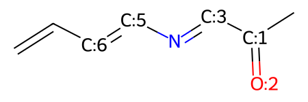

===================================================================
Example Descriptors Workflow using RDKit, Modred, Morfeus & DBStep
===================================================================

.. contents::
    :local:

Installation
-------------

1. Installation of RDKit

.. code:: shell

    conda install -c conda-forge rdkit
    

2. Installation of Modred

.. code:: shell

    pip install modred
    
   
3. Installation of Morfeus

.. code:: shell
    
    conda install -c conda-forge morfeus-ml

4. Installation of Dbstep

.. code:: shell
    
    conda install -c conda-forge dbstep

Dependencies
-------------

1. numpy 
2. scipy
3. xtb-python (Morfeus)

Example notebook
----------------

RDKit: a cheminformatics package 
================================

RDKit is primiarly used for creation, and manipulation of chemical
structures.

https://www.rdkit.org/docs/GettingStartedInPython.html

.. code:: python

    import rdkit #rdkit.Chem.SOMEFUNCTION
    from rdkit import Chem #Chem.SOMEFUNCTION

Step 1: 2D smiles to 3D structure
~~~~~~~~~~~~~~~~~~~~~~~~~~~~~~~~~

RDkit deals with molecules as mol objects. These mol objects can be
created from either 2D or 3D files. This mol object is the base to
everything that is done in rdkit

.. code:: python

    m1 = Chem.MolFromSmiles('CCc1ccccc1')

.. code:: python

    type(m1)

.. parsed-literal::

    rdkit.Chem.rdchem.Mol

.. code:: python

    m1

.. image:: images/cheminfo_7_0.png

.. code:: python

    #What is the coordinates of the molecule?
    print(Chem.MolToMolBlock(m1))

.. parsed-literal::

    
         RDKit          2D
    
      8  8  0  0  0  0  0  0  0  0999 V2000
        3.7500   -1.2990    0.0000 C   0  0  0  0  0  0  0  0  0  0  0  0
        3.0000    0.0000    0.0000 C   0  0  0  0  0  0  0  0  0  0  0  0
        1.5000    0.0000    0.0000 C   0  0  0  0  0  0  0  0  0  0  0  0
        0.7500   -1.2990    0.0000 C   0  0  0  0  0  0  0  0  0  0  0  0
       -0.7500   -1.2990    0.0000 C   0  0  0  0  0  0  0  0  0  0  0  0
       -1.5000    0.0000    0.0000 C   0  0  0  0  0  0  0  0  0  0  0  0
       -0.7500    1.2990    0.0000 C   0  0  0  0  0  0  0  0  0  0  0  0
        0.7500    1.2990    0.0000 C   0  0  0  0  0  0  0  0  0  0  0  0
      1  2  1  0
      2  3  1  0
      3  4  2  0
      4  5  1  0
      5  6  2  0
      6  7  1  0
      7  8  2  0
      8  3  1  0
    M  END
    

.. code:: python

    #Notice only C, no H?
    m2 = Chem.AddHs(m1) #m3 = Chem.RemoveHs(m2)
    m2

.. code:: python

    print(Chem.MolToMolBlock(m2))

.. parsed-literal::

         RDKit          2D
    
     18 18  0  0  0  0  0  0  0  0999 V2000
        4.5000    0.0000    0.0000 C   0  0  0  0  0  0  0  0  0  0  0  0
        3.0000    0.0000    0.0000 C   0  0  0  0  0  0  0  0  0  0  0  0
        1.5000    0.0000    0.0000 C   0  0  0  0  0  0  0  0  0  0  0  0
        0.7500   -1.2990    0.0000 C   0  0  0  0  0  0  0  0  0  0  0  0
       -0.7500   -1.2990    0.0000 C   0  0  0  0  0  0  0  0  0  0  0  0
       -1.5000    0.0000    0.0000 C   0  0  0  0  0  0  0  0  0  0  0  0
       -0.7500    1.2990    0.0000 C   0  0  0  0  0  0  0  0  0  0  0  0
        0.7500    1.2990    0.0000 C   0  0  0  0  0  0  0  0  0  0  0  0
        6.0000    0.0000    0.0000 H   0  0  0  0  0  0  0  0  0  0  0  0
        4.5000    1.5000    0.0000 H   0  0  0  0  0  0  0  0  0  0  0  0
        4.5000   -1.5000    0.0000 H   0  0  0  0  0  0  0  0  0  0  0  0
        3.0000   -1.5000    0.0000 H   0  0  0  0  0  0  0  0  0  0  0  0
        3.0000    1.5000    0.0000 H   0  0  0  0  0  0  0  0  0  0  0  0
        1.5000   -2.5981    0.0000 H   0  0  0  0  0  0  0  0  0  0  0  0
       -1.5000   -2.5981    0.0000 H   0  0  0  0  0  0  0  0  0  0  0  0
       -3.0000    0.0000    0.0000 H   0  0  0  0  0  0  0  0  0  0  0  0
       -1.5000    2.5981    0.0000 H   0  0  0  0  0  0  0  0  0  0  0  0
        1.5000    2.5981    0.0000 H   0  0  0  0  0  0  0  0  0  0  0  0
      1  2  1  0
      2  3  1  0
      3  4  2  0
      4  5  1  0
      5  6  2  0
      6  7  1  0
      7  8  2  0
      8  3  1  0
      1  9  1  0
      1 10  1  0
      1 11  1  0
      2 12  1  0
      2 13  1  0
      4 14  1  0
      5 15  1  0
      6 16  1  0
      7 17  1  0
      8 18  1  0
    M  END
    
.. code:: python

    #going from 2D to 3D with proper coordinates?
    from rdkit.Chem import AllChem

.. code:: python

    # rdkit.Chem.AllChem.EmbedMolecule(m2,randomSeed=0xf00d)
    AllChem.EmbedMolecule(m2,randomSeed=0xf00d)   # optional random seed for reproducibility)
    print(Chem.MolToMolBlock(m2))

.. parsed-literal::

    
         RDKit          3D
    
     18 18  0  0  0  0  0  0  0  0999 V2000
       -2.3976    0.1850    0.5701 C   0  0  0  0  0  0  0  0  0  0  0  0
       -1.6138   -0.1868   -0.6938 C   0  0  0  0  0  0  0  0  0  0  0  0
       -0.1705   -0.1457   -0.3518 C   0  0  0  0  0  0  0  0  0  0  0  0
        0.5315   -1.2300    0.1244 C   0  0  0  0  0  0  0  0  0  0  0  0
        1.8853   -1.1497    0.4335 C   0  0  0  0  0  0  0  0  0  0  0  0
        2.4910    0.0702    0.2394 C   0  0  0  0  0  0  0  0  0  0  0  0
        1.8408    1.1851   -0.2327 C   0  0  0  0  0  0  0  0  0  0  0  0
        0.4967    1.0651   -0.5283 C   0  0  0  0  0  0  0  0  0  0  0  0
       -2.2479    1.2901    0.7442 H   0  0  0  0  0  0  0  0  0  0  0  0
       -3.4538   -0.0835    0.4622 H   0  0  0  0  0  0  0  0  0  0  0  0
       -1.9001   -0.3130    1.4305 H   0  0  0  0  0  0  0  0  0  0  0  0
       -1.8850   -1.2311   -0.9487 H   0  0  0  0  0  0  0  0  0  0  0  0
       -1.8395    0.5285   -1.5133 H   0  0  0  0  0  0  0  0  0  0  0  0
        0.0058   -2.1670    0.2587 H   0  0  0  0  0  0  0  0  0  0  0  0
        2.3938   -2.0289    0.8048 H   0  0  0  0  0  0  0  0  0  0  0  0
        3.5420    0.1352    0.4786 H   0  0  0  0  0  0  0  0  0  0  0  0
        2.3706    2.1413   -0.3714 H   0  0  0  0  0  0  0  0  0  0  0  0
       -0.0494    1.9353   -0.9063 H   0  0  0  0  0  0  0  0  0  0  0  0
      1  2  1  0
      2  3  1  0
      3  4  2  0
      4  5  1  0
      5  6  2  0
      6  7  1  0
      7  8  2  0
      8  3  1  0
      1  9  1  0
      1 10  1  0
      1 11  1  0
      2 12  1  0
      2 13  1  0
      4 14  1  0
      5 15  1  0
      6 16  1  0
      7 17  1  0
      8 18  1  0
    M  END
    

.. code:: python

    m2

.. image:: images/cheminfo_13_0.png

.. code:: python

    #can we wrtie it to a xyz file? sdf file?
    from rdkit.Chem import rdmolfiles #https://www.rdkit.org/docs/source/rdkit.Chem.rdmolfiles.html

.. code:: python

    rdmolfiles.MolToXYZFile(m2,'mol1.xyz')

.. code:: python

    rdmolfiles.MolToPDBFile(m2,'mol1.pdb')

.. code:: python

    rdmolfiles.MolToSmiles(m2)

.. parsed-literal::

    '[H]c1c([H])c([H])c(C([H])([H])C([H])([H])[H])c([H])c1[H]'

Step 2: RDKit for molecular, atomic and bond properties
~~~~~~~~~~~~~~~~~~~~~~~~~~~~~~~~~~~~~~~~~~~~~~~~~~~~~~~

RDKit can obtain simple molecular properties. For example -> number of
atoms, number of bond, etcs.,

.. code:: python

    # molecular weight
    Chem.rdMolDescriptors.CalcExactMolWt(m2)

.. parsed-literal::

    106.07825032

.. code:: python

    list(m2.GetAtoms())

.. parsed-literal::

    [<rdkit.Chem.rdchem.Atom at 0x7fa779dd5740>,
     <rdkit.Chem.rdchem.Atom at 0x7fa779dd57b0>,
     <rdkit.Chem.rdchem.Atom at 0x7fa779dd5820>,
     <rdkit.Chem.rdchem.Atom at 0x7fa779dd5890>,
     <rdkit.Chem.rdchem.Atom at 0x7fa779dd5900>,
     <rdkit.Chem.rdchem.Atom at 0x7fa779dd5970>,
     <rdkit.Chem.rdchem.Atom at 0x7fa779dd59e0>,
     <rdkit.Chem.rdchem.Atom at 0x7fa779dd5a50>,
     <rdkit.Chem.rdchem.Atom at 0x7fa779dd5ac0>,
     <rdkit.Chem.rdchem.Atom at 0x7fa779dd5b30>,
     <rdkit.Chem.rdchem.Atom at 0x7fa779dd5ba0>,
     <rdkit.Chem.rdchem.Atom at 0x7fa779dd5c10>,
     <rdkit.Chem.rdchem.Atom at 0x7fa779dd5c80>,
     <rdkit.Chem.rdchem.Atom at 0x7fa779dd5cf0>,
     <rdkit.Chem.rdchem.Atom at 0x7fa779dd5d60>,
     <rdkit.Chem.rdchem.Atom at 0x7fa779dd5dd0>,
     <rdkit.Chem.rdchem.Atom at 0x7fa779dd5e40>,
     <rdkit.Chem.rdchem.Atom at 0x7fa779dd5eb0>]

.. code:: python

    # can loop over every atom in the molecule
    for atom in m2.GetAtoms():
        print(atom.GetSymbol(),atom.GetIdx(),atom.GetAtomicNum())

.. parsed-literal::

    C 0 6
    C 1 6
    C 2 6
    C 3 6
    C 4 6
    C 5 6
    C 6 6
    C 7 6
    H 8 1
    H 9 1
    H 10 1
    H 11 1
    H 12 1
    H 13 1
    H 14 1
    H 15 1
    H 16 1
    H 17 1

.. code:: python

    type(m2)

.. parsed-literal::

    rdkit.Chem.rdchem.Mol

.. code:: python

    list(m2.GetBonds())

.. parsed-literal::

    [<rdkit.Chem.rdchem.Bond at 0x7fa779f293c0>,
     <rdkit.Chem.rdchem.Bond at 0x7fa779f29430>,
     <rdkit.Chem.rdchem.Bond at 0x7fa779f294a0>,
     <rdkit.Chem.rdchem.Bond at 0x7fa779f29510>,
     <rdkit.Chem.rdchem.Bond at 0x7fa779f29580>,
     <rdkit.Chem.rdchem.Bond at 0x7fa779f295f0>,
     <rdkit.Chem.rdchem.Bond at 0x7fa779f29660>,
     <rdkit.Chem.rdchem.Bond at 0x7fa779f296d0>,
     <rdkit.Chem.rdchem.Bond at 0x7fa779f29740>,
     <rdkit.Chem.rdchem.Bond at 0x7fa779f297b0>,
     <rdkit.Chem.rdchem.Bond at 0x7fa779f29820>,
     <rdkit.Chem.rdchem.Bond at 0x7fa779f29890>,
     <rdkit.Chem.rdchem.Bond at 0x7fa779f29900>,
     <rdkit.Chem.rdchem.Bond at 0x7fa779f29970>,
     <rdkit.Chem.rdchem.Bond at 0x7fa779f299e0>,
     <rdkit.Chem.rdchem.Bond at 0x7fa779f29a50>,
     <rdkit.Chem.rdchem.Bond at 0x7fa779f29ac0>,
     <rdkit.Chem.rdchem.Bond at 0x7fa779f29b30>]

.. code:: python

    # can loop over every atom in the molecule
    for bond in m2.GetBonds():
        print(bond.GetBondType(),bond.GetBeginAtomIdx(), bond.GetEndAtomIdx(), )

.. parsed-literal::

    SINGLE 0 1
    SINGLE 1 2
    AROMATIC 2 3
    AROMATIC 3 4
    AROMATIC 4 5
    AROMATIC 5 6
    AROMATIC 6 7
    AROMATIC 7 2
    SINGLE 0 8
    SINGLE 0 9
    SINGLE 0 10
    SINGLE 1 11
    SINGLE 1 12
    SINGLE 3 13
    SINGLE 4 14
    SINGLE 5 15
    SINGLE 6 16
    SINGLE 7 17

.. code:: python

    print(m2.GetAtomWithIdx(0).GetSymbol())
    print(m2.GetAtomWithIdx(0).GetExplicitValence())
    print(m2.GetBondWithIdx(6).GetBeginAtomIdx())
    print(m2.GetBondWithIdx(3).GetEndAtomIdx())
    print(m2.GetBondBetweenAtoms(0,1).GetBondType())

.. parsed-literal::

    C
    4
    6
    4
    SINGLE

.. code:: python

    def mol_with_atom_index(mol):
        for atom in mol.GetAtoms():
            atom.SetAtomMapNum(atom.GetIdx())
        return mol

.. code:: python

    mol_with_atom_index(m2)

.. code:: python

    #Whats next to each other? Atoms keep track of their neighbors
    atom = m2.GetAtomWithIdx(0)
    neighbors = [x.GetAtomicNum() for x in atom.GetNeighbors()]
    neighbors

.. parsed-literal::

    [6, 1, 1, 1]

.. code:: python

    #Can check if in a ring?
    m2.GetAtomWithIdx(1).IsInRingSize(6)

.. parsed-literal::

    False

Other RDKit properties -> check out https://www.rdkit.org/docs/GettingStartedInPython.html
^^^^^^^^^^^^^^^^^^^^^^^^^^^^^^^^^^^^^^^^^^^^^^^^^^^^^^^^^^^^^^^^^^^^^^^^^^^^^^^^^^^^^^^^^^

Step 3: Other RDkit Descriptors
~~~~~~~~~~~~~~~~~~~~~~~~~~~~~~~

.. code:: python

    # Descriptors - https://www.rdkit.org/docs/source/rdkit.Chem.Descriptors.html#module-rdkit.Chem.Descriptors
    from rdkit.Chem import Descriptors

.. code:: python

    m = Chem.MolFromSmiles('c1ccccc1C(=O)O')
    print('TPSA:', Descriptors.TPSA(m))
    print('ExactMolWt:', Descriptors.ExactMolWt(m))

.. parsed-literal::

    TPSA: 37.3
    ExactMolWt: 122.036779432

.. code:: python

    # Graph Descriptors - https://www.rdkit.org/docs/source/rdkit.Chem.GraphDescriptors.html
    from rdkit.Chem import GraphDescriptors

.. code:: python

    m = Chem.MolFromSmiles('c1ccccc1C(=O)O')
    print('BalabanJ:', GraphDescriptors.BalabanJ(m))
    print('BertzCT:', GraphDescriptors.BertzCT(m))
    print('HallKierAlpha:',GraphDescriptors.HallKierAlpha(m))

.. parsed-literal::

    BalabanJ: 2.98145461404113
    BertzCT: 203.415952604261
    HallKierAlpha: -1.31

.. code:: python

    # Fingerprints - https://www.rdkit.org/docs/source/rdkit.Chem.GraphDescriptors.html
    from rdkit.Chem import GraphDescriptors
    from rdkit.Chem.AtomPairs.Pairs import GetAtomPairFingerprintAsBitVect
    from rdkit.Chem import MACCSkeys

.. code:: python

    m = Chem.MolFromSmiles('c1ccccc1C(=O)O')
    fp1 = AllChem.GetMorganFingerprint(m, 2) # radius, number of bits
    fp2 = GetAtomPairFingerprintAsBitVect(m) # number of bits
    fp3 = MACCSkeys.GenMACCSKeys(m)

.. code:: python

    print(fp1, fp2, fp3)

.. parsed-literal::

    <rdkit.DataStructs.cDataStructs.UIntSparseIntVect object at 0x7fa779f8d900> \
    <rdkit.DataStructs.cDataStructs.SparseBitVect object at 0x7fa779f2b8b0> \
     <rdkit.DataStructs.cDataStructs.ExplicitBitVect object at 0x7fa779fa0900>

.. code:: python

    print(fp3.ToList())

.. parsed-literal::

    [0, 0, 0, 0, 0, 0, 0, 0, 0, 0, 0, 0, 0, 0, 0, 0, 0, 0, 0, 0, 0, 0, 0, 0, 0, 0, 0, 0, 0, 0, 0, 0, 0, 0, 0, 0, 0, 0, 0, 0, 0, 0, 0, 0, 0, 0, 0, 0, 0, 0, 0, 0, 0, 0, 0, 0, 0, 0, 0, 0, 0, 0, 0, 0, 0, 0, 0, 0, 0, 0, 0, 0, 0, 0, 0, 0, 0, 0, 0, 0, 0, 0, 0, 0, 0, 0, 0, 0, 0, 0, 0, 0, 0, 0, 0, 0, 0, 0, 0, 0, 0, 0, 0, 0, 0, 0, 0, 0, 0, 0, 0, 0, 0, 0, 0, 0, 0, 0, 0, 0, 0, 0, 0, 1, 0, 0, 0, 0, 0, 0, 0, 0, 0, 0, 0, 0, 0, 0, 0, 1, 0, 0, 0, 0, 0, 0, 0, 0, 0, 0, 0, 0, 0, 0, 1, 0, 0, 1, 0, 1, 0, 0, 1, 1, 1, 1, 0]

.. code:: python

    info={}
    m = Chem.MolFromSmiles('c1ccccc1C(=O)O')
    fp = AllChem.GetMorganFingerprint(m,2,bitInfo=info)
    print('length of non zero elements:', len(fp.GetNonzeroElements()))
    
    print('information of bits:', info)
    
    print('bit on:', info[98513984])
    
    #bit 98513984 is set three times: once by atom 1, once by atom 2,  and once by atom 3
    #each at radius 1.

.. parsed-literal::

    length of non zero elements: 16
    information of bits: {98513984: ((1, 1), (2, 1), (3, 1)), 128522177: ((0, 2), (4, 2)), \
                        864662311: ((8, 0),), 864942730: ((7, 0),), 951226070: ((4, 1), (0, 1)), \
                        1466409066: ((5, 2),), 1510328189: ((7, 1),), 1533864325: ((8, 1),),\
                         1710869618: ((6, 2),), 2246699815: ((6, 0),), 2763854213: ((2, 2),), \
                         2784506312: ((6, 1),), 2994748777: ((5, 1),), 3217380708: ((5, 0),), 
                         3218693969: ((0, 0), (1, 0), (2, 0), (3, 0), (4, 0)), 3999906991: ((3, 2), (1, 2))}
    bit on: ((1, 1), (2, 1), (3, 1))

.. code:: python

    env = Chem.FindAtomEnvironmentOfRadiusN(m,1,1)
    amap={}
    submol=Chem.PathToSubmol(m,env,atomMap=amap)
    print('Number of atoms in substructure:',submol.GetNumAtoms())
    print(amap)
    print('substructure:', Chem.MolToSmiles(submol))
    submol # can be used in finding important subtructures when modelling a reaction.

.. parsed-literal::

    Number of atoms in substructure: 3
    {0: 0, 1: 1, 2: 2}
    substructure: ccc

.. code:: python

    #3D Descriptors - https://www.rdkit.org/docs/source/rdkit.Chem.Descriptors3D.html
    from rdkit.Chem import Descriptors3D

.. code:: python

    m = Chem.MolFromSmiles('c1ccccc1C(=O)O')
    m = Chem.AddHs(m)
    AllChem.EmbedMolecule(m,randomSeed=0xf00d)   # need to get 3D coordinates
    
    print('Asphericity:', Descriptors3D.Asphericity(m))
    print('Eccentricity:', Descriptors3D.Eccentricity(m))
    print('PMI1:',Descriptors3D.PMI1(m))
    print('RadiusOfGyration:',Descriptors3D.RadiusOfGyration(m))

.. parsed-literal::

    Asphericity: 0.4655222070385021
    Eccentricity: 0.9727422264868102
    PMI1: 127.14659990729236
    RadiusOfGyration: 2.1193375600449276

Step 4: Substructure matching
~~~~~~~~~~~~~~~~~~~~~~~~~~~~~

.. code:: python

    m = Chem.MolFromSmiles('c1ccccc1C(=O)O') # can be done with chiral smiles to preserve chirality
    patt = Chem.MolFromSmarts('C(=O)O') 
    print('Is substructure present?', m.HasSubstructMatch(patt), '\nAtoms in substurcture:',m.GetSubstructMatch(patt))

.. parsed-literal::

    Is substructure present? True 
    Atoms in substurcture: (6, 7, 8)

Step 5: Chemical transformations
~~~~~~~~~~~~~~~~~~~~~~~~~~~~~~~~

.. code:: python

    rxn = AllChem.ReactionFromSmarts('[C:1]=[C:2].[C:3]=[*:4][*:5]=[C:6]>>[C:1]1[C:2][C:3][*:4]=[*:5][C:6]1')
    rxn

.. code:: python

    print( 'number of reactant:', rxn.GetNumReactantTemplates())
    print( 'number of product:', rxn.GetNumProductTemplates())

.. parsed-literal::

    number of reactant: 2
    number of product: 1

.. code:: python

    mols = [Chem.MolFromSmiles('OC=C'), Chem.MolFromSmiles('C=CC(N)=C')]
    mols[0]

.. image:: images/cheminfo_49_0.png

.. code:: python

    ps = rxn.RunReactants((mols[0], mols[1]))

.. code:: python

    print('product:', Chem.MolToSmiles(ps[0][0]))
    ps[0][0]

.. parsed-literal::

    product: NC1=CCCC(O)C1

.. image:: images/cheminfo_51_1.png

Step 6: Atom/Bond deletion/addition
~~~~~~~~~~~~~~~~~~~~~~~~~~~~~~~~~~~

.. code:: python

    m = Chem.MolFromSmiles('CC(=O)C=CC=C')
    mw = Chem.RWMol(m)
    mol_with_atom_index(mw)

.. code:: python

    mw.ReplaceAtom(4,Chem.Atom(7))
    mw

.. image:: images/cheminfo_54_0.png

.. code:: python

    mw.AddAtom(Chem.Atom(6))
    mw

.. code:: python

    mw.AddAtom(Chem.Atom(6))
    mw

.. code:: python

    mw.AddBond(6,7,Chem.BondType.SINGLE)
    mw

.. code:: python

    mw.AddBond(7,8,Chem.BondType.DOUBLE)
    mw

.. code:: python

    mw.AddBond(8,3,Chem.BondType.SINGLE)
    mw

.. image:: images/cheminfo_59_0.png

.. code:: python

    mw.RemoveAtom(0)
    mw

.. image:: images/cheminfo_60_0.png

.. code:: python

    mw.GetNumAtoms()

.. parsed-literal::

    8

.. code:: python

    ### other RDKIT things: Fragments on a moelcule (functional groups), visualizing pictures of molecules

Modred: a descriptors package 
=============================

Modred is used to collect important chemical descriptors

https://github.com/mordred-descriptor/mordred

.. code:: python

    from rdkit import Chem
    from mordred import Calculator, descriptors

.. code:: python

    # create descriptor calculator with all descriptors
    calc = Calculator(descriptors, ignore_3D=True)
    print('all descriptors:', len(calc.descriptors), '\nnon 3D descriptors:',
        len(Calculator(descriptors, ignore_3D=True, version="1.0.0")))

.. parsed-literal::

    all descriptors: 1613 
    non 3D descriptors: 1612

.. code:: python

    mol = Chem.MolFromSmiles('c1ccccc1')
    calc(mol)[:3]

.. parsed-literal::

    [4.242640687119286, 3.9999999999999996, 0]

.. code:: python

    # calculate multiple molecule
    mols = [Chem.MolFromSmiles(smi) for smi in ['c1ccccc1Cl', 'c1ccccc1O', 'c1ccccc1N']]
    
    # as pandas
    df = calc.pandas(mols)
    df['SLogP']

.. parsed-literal::

    0    2.3400
    1    1.3922
    2    1.2688
    Name: SLogP, dtype: float64

.. code:: python

    #https://github.com/mordred-descriptor/mordred/tree/develop/examples for examples

Morfeus: a descriptors package 
==============================

Morfeus is used to collect chemical descriptors

https://github.com/kjelljorner/morfeus

::

   - Bite angle
   - Buried volume
   - Conformer tools
   - Dispersion descriptor
   - Exact ligand cone angle
   - Ligand solid angle
   - Local force constant
   - Pyramidalization
   - Solvent accessible surface area
   - Sterimol parameters
   - XTB electronic descriptors

.. code:: python

    from morfeus import BuriedVolume, Dispersion, SASA, Sterimol

.. code:: python

    m = Chem.MolFromSmiles('c1ccccc1C(=O)O')
    m = Chem.AddHs(m)
    AllChem.EmbedMolecule(m,randomSeed=0xf00d)   # need to get 3D coordinates
    
    #need xyz coords and elements
    coords = m.GetConformers()[0].GetPositions()
    elements = np.array([atom.GetSymbol() for atom in m.GetAtoms()])
    
    atom1 = 1
    atom2 = 3
    
    #Buried Volume
    bv = BuriedVolume(elements, coords, atom1, z_axis_atoms=atom2)
    bur_vol = bv.buried_volume
    print('Buried Volume:', bur_vol)
    
    #Dispersion - the molecular surface is constructed from vdW spheres and an internal D3 code is used. 
    #Can change radii and D4 corrections
    disp = Dispersion(elements, coords)
    disp.print_report()
    
    #SASA
    sasa = SASA(elements, coords)
    sasa.print_report()
    
    #Sterimol
    sterimol = Sterimol(elements, coords, atom1, atom2)
    sterimol.print_report()

.. parsed-literal::

    Buried Volume: 89.27842130648575
    Surface area (Ų): 170.1
    Surface volume (ų): 150.6
    P_int (kcal¹ᐟ² mol⁻¹ᐟ²): 16.4
    Probe radius (Å): 1.4
    Solvent accessible surface area (Ų): 283.6
    Volume inside solvent accessible surface (ų): 394.9
    L         B_1       B_5       
    4.89      1.70      4.88      

.. code:: python

    from morfeus import XTB
    #conda config --add channels conda-forge
    #conda install xtb-python

.. code:: python

    xtb = XTB(elements, coords)
    print('IP:', xtb.get_ip())
    
    print('IP corrected:', xtb.get_ip(corrected=True))
    
    print('EA:',xtb.get_ea())
    
    print('HOMO:',xtb.get_homo())
    
    print('charges:', xtb.get_charges())
    
    print('Bond order between 1 and 2:', xtb.get_bond_order(1, 2))
    
    print('Dipole:', xtb.get_dipole())
    
    print('Electrophilicity:', xtb.get_global_descriptor("electrophilicity", corrected=True))
    
    print('Nucleophilicity:', xtb.get_global_descriptor("nucleophilicity", corrected=True))
    
    print('Electrophilicity:', xtb.get_fukui("electrophilicity"))
    
    print('Nucleophilicity:',xtb.get_fukui("nucleophilicity"))

.. parsed-literal::

    IP: 14.21907376745269

    IP corrected: 9.37307376745269

    EA: 4.845571590387933

    HOMO: -0.41623955979447214

    charges: {1: -0.023731318132732028, 2: -0.023806077539105235, 3: -0.018447089674853395, 4: -0.025961908777158052, \
    5: -0.015545768011596933, 6: -0.0042367614165342155, 7: 0.3485846814351815, 8: -0.41382958434066375,\
     9: -0.4024772967915211, 10: 0.05934658603981254, 11: 0.040052712074922316, 12: 0.04553152875917119, \
     13: 0.043574951519552735, 14: 0.06536032181985, 15: 0.32558502303567083}

    Bond order between 1 and 2: 1.4531011522314383

    Dipole: [-0.72609434  0.87239314  0.17591641]

    Electrophilicity: 1.1714735771171472

    Nucleophilicity: -9.37307376745269

    Electrophilicity: {1: 0.03911773287813523, 2: 0.026346314554852417, 3: 0.06454830639292795, 4: 0.02786250448009861,\
     5: 0.03376261308410905, 6: 0.05222019595834877, 7: 0.07074874851467716, 8: 0.171583858476282, 9: 0.07271258423075233,\ 
     10: 0.06680704294355236, 11: 0.07681263223202173, 12: 0.08592262797262706, 13: 0.07621979888353578, \
     14: 0.06477217961589259, 15: 0.07056285978219684}

    Nucleophilicity: {1: 0.04377913232024513, 2: 0.04531234210302857, 3: 0.02905922254817471, 4: 0.044454767912915666, \
    5: 0.03748785231291066, 6: 0.03691186476868924, 7: 0.021635431859494292, 8: 0.1786549461532222, 9: 0.07648297999552217, \
    10: 0.07833353457469319, 11: 0.09660677617261712, 12: 0.08845612247521087, 13: 0.0904851465534236, \
    14: 0.07415823218296759, 15: 0.05818164809002663}

DBstep: a descriptors package 
=============================

DBstep is used to collect sterimol descriptors

.. code:: python

    from dbstep.Dbstep import dbstep

.. code:: python

    m = Chem.MolFromSmiles('c1ccccc1C(=O)O')
    m = Chem.AddHs(m)
    AllChem.EmbedMolecule(m,randomSeed=0xf00d)   # need to get 3D coordinates

.. code:: python

    mol_with_atom_index(m)

.. code:: python

    Et_sterics = dbstep(m2, sterimol=True,volume=True, atom1=7, atom2=6)

.. parsed-literal::

          R/Å     %V_Bur     %S_Bur       Bmin       Bmax          L
         3.50      37.08       0.00       1.68       6.41       4.30

.. code:: python

    Et_sterics = dbstep(m2, sterimol=True,volume=True, atom1=7, atom2=6, scan='0:5:1')

.. parsed-literal::

          R/Å     %V_Bur     %S_Bur       Bmin       Bmax          L
         0.00       0.00       0.00       1.68       6.37       1.00
         1.00     100.00     100.00       1.68       5.73       2.00
         2.00      84.43      52.96       1.65       4.70       3.00
         3.00      48.43      22.15       1.54       4.37       4.00
         4.00      29.54      11.75       0.29       3.63       4.30
         5.00      18.97       4.70       0.00       1.86       4.30
    
       L parameter is  4.30 Ang

