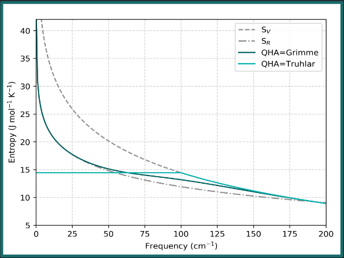

==========================
Example GoodVibes Workflow 
==========================

`GoodVibes GitHub Page <https://github.com/patonlab/GoodVibes/>`_

`Article <https://f1000research.com/articles/9-291/v1>`_

Installation
-------------

Version 3.2 is most up to date. Install with:

.. code:: shell

    pip install goodvibes

or

.. code:: shell

    pip install --upgrade goodvibes

or 

.. code:: shell

    conda install -c conda-forge goodvibes

(you may also need to install matplotlib)

Computing Thermochemistry for QM Output Files
----------------------------------------------

You can find the necessary files for this example :download:`here <resources/CompChem_2-15-23.zip>`.

.. code:: shell

    python -m goodvibes H2O.log

Grabs Energy, frequencies, and computes thermochemical values Enthalpy (H), Entropy (S), Gibbs Free Energy (G).
Also computes quasi-harmonic corrected Entropy (qh-S) and Free Energy (qh-G).

Compute G as ``G = H - (T * S)``

Temperature Corrections
-----------------------

The default temperature in GoodVibes in ``298.15 K`` (25C)

What if the reaction was run at 100C?

.. code:: shell

    python -m goodvibes benzene.log -t 373.15

GoodVibes can also compute temperature ranges.

.. code:: shell

    python -m goodvibes benzene.log H2O.log --ti 250,400,50

This will compute the thermochemical values for both output files at temperatures ranging from 250K to 400K every 50K.

Quasi-Harmonic Corrections
--------------------------

The quasi-harmonic correction has a greater effect when molecules have a greater number of low-frequency vibrational modes.
For example:

* Methylaniline: 2 vibrational modes below 200cm-1
* Int-III: 23 vibrational modes below 200cm-1

.. code:: shell

    python -m goodvibes methylaniline.log Int-III.log

Single Point Calculations 
-------------------------

Useful for saving on computational resources:

We can optimize molecules at a lower level of theory to still obtain an accurate geometry, but do a single point energy calculation (SPC) at a higher level of theory to obtain more accurate energy values.

With the ``--spc`` argument, we can specify how the SPC file names are formatted.

.. list-table:: File Naming Scheme
    :header-rows: 1

    * - Calculation Type
      - Filename
    * - opt/freq
      - file.log
    * - SPC
      - file_SPC.log

For example: ``ethane.log`` and ``ethane_TZ.out``

.. code:: shell

    python -m goodvibes ethane.log --spc TZ 

Potential Energy Surface Calculations:
--------------------------------------

GoodVibes can compute relative energy/thermochemistry values to describe a reaction pathway with a potential energy surface

To do this, we need to write a yaml file with 3 sections:

* PES
    * Defines reaction pathway
    * Can add multiple pathways 
* SPECIES 
    * Relates files to each species in the reaction pathway  
* FORMAT 
    * Optional additional formatting 
  
.. literalinclude:: resources/gv_files/pes/PhPy.yaml

Putting it All Together
-----------------------

* Temperature adjustments
* Single Point Calculations
* Potential Energy Surface Calculations

We can use these 24 intermediate and transition state calculations + corresponding SPC files + yaml to define a reaction pathway

.. code:: shell

    python -m goodvibes *.log -t 353.15 --spc DLPNO --imag --invertifreq -f --pes PhPy.yaml

Graphing these potential energy surfaces is simple once the yaml file is created

.. code:: shell

    python -m goodvibes *.log -t 353.15 --spc DLPNO --imag --invertifreq -5 --pes PhPy.yaml --graph PhPy.yaml

Check out other packages by our lab @ our `github <https://github.com/patonlab>`_