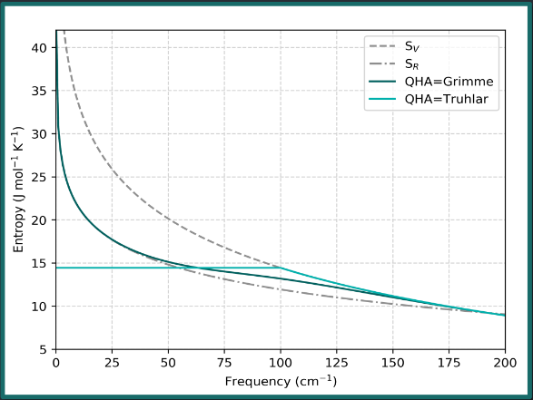
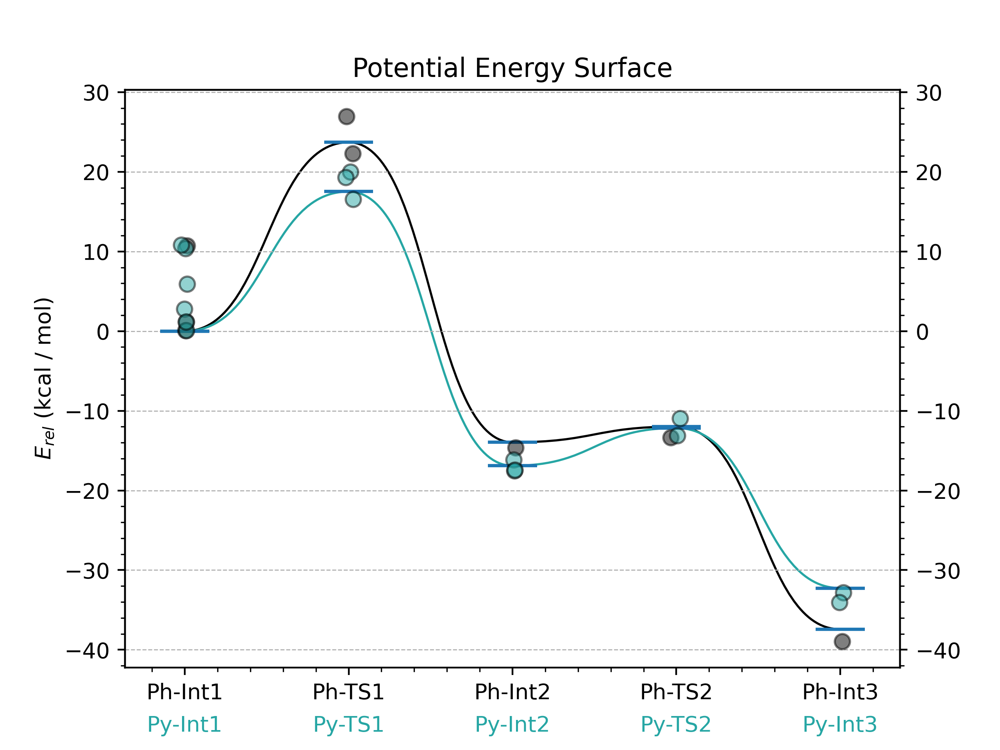

==========================
GoodVibes 
==========================

.. contents::
    :local:

Here is the `GoodVibes GitHub Page <https://github.com/patonlab/GoodVibes/>`_

Here is the `GoodVibes Publication <https://f1000research.com/articles/9-291/v1>`_

Installation
-------------

This page was last checked against GoodVibes 4.4.0 (requires Python >= 3.9). Check your
installed version with ``goodvibes --version`` and the full list of options with
``goodvibes -h``. Install with:

.. code:: shell

    pip install goodvibes

or

.. code:: shell

    uv pip install goodvibes

or 

.. code:: shell

    conda install -c conda-forge goodvibes

(you may also need to install matplotlib)

Computing Thermochemistry for QM Output Files
----------------------------------------------

You can run this code using any output file from QM calculations.
 
.. code:: shell

    goodvibes H2O.log

You should get the following output:

.. highlight:: none

.. literalinclude:: resources/jupyter_outputs.txt
    :start-after: water-start
    :end-before: water-end

.. highlight:: default

Grabs Energy, frequencies, and computes thermochemical values Enthalpy (H), Entropy (S), Gibbs Free Energy (G).
Also computes quasi-harmonic corrected Entropy (qh-S) and Free Energy (qh-G).

Compute G as ``G = H - (T * S)``

Temperature Corrections
-----------------------

The default temperature in GoodVibes is ``298.15 K`` (25C)

What if the reaction was run at 100C?

.. code:: none

    goodvibes benzene.log --temp 373.15

This will give the following output:

.. highlight:: none

.. literalinclude:: resources/jupyter_outputs.txt
    :start-after: benzene_temp-start
    :end-before: benzene_temp-end

.. highlight:: default

GoodVibes can also compute temperature ranges.

.. code:: none

    goodvibes benzene.log H2O.log --ti 250,400,50

This will give the output:

.. highlight:: none

.. literalinclude:: resources/jupyter_outputs.txt
    :start-after: benzene_water-start
    :end-before: benzene_water-end

.. highlight:: default

This computes the thermochemical values for both output files at temperatures ranging from 250K to 400K every 50K.

Quasi-Harmonic Corrections
--------------------------

.. centered:: |QH-correction|

The quasi-harmonic correction has a greater effect when molecules have a greater number of low-frequency vibrational modes.
For example:

* Methylaniline: 2 vibrational modes below 200 cm\ :sup:`-1`
* Int-III: 23 vibrational modes below 200 cm\ :sup:`-1`

.. code:: shell

    goodvibes methylaniline.log Int-III.log

This gives the output:

.. highlight:: none

.. literalinclude:: resources/jupyter_outputs.txt
    :start-after: methylaniline-start
    :end-before: methylaniline-end

.. highlight:: default

Why is a quasi-harmonic correction needed? In the rigid-rotor harmonic-oscillator (RRHO)
approximation, the vibrational entropy of a mode diverges as its frequency approaches zero,
so floppy low-frequency modes (below ~100 cm\ :sup:`-1`) are given unphysically large entropies.
GoodVibes offers two ways of fixing this:

* ``--qs grimme`` (default): Grimme's approach, which interpolates between the harmonic-oscillator
  and free-rotor entropy for low-frequency modes
  (`Grimme, Chem. Eur. J. 2012, 18, 9955 <https://doi.org/10.1002/chem.201200497>`__).
* ``--qs truhlar``: Truhlar's approach, which raises all frequencies below the cutoff to the
  cutoff value (`Ribeiro et al., J. Phys. Chem. B 2011, 115, 14556 <https://doi.org/10.1021/jp205508z>`__).

The cutoff frequency is set with ``-f`` (default 100 cm\ :sup:`-1`). A related correction to the enthalpy
(`Li et al., J. Phys. Chem. C 2015, 119, 1840 <https://doi.org/10.1021/jp509921r>`__) can be applied
with ``--qh``, or ``-q`` applies both the entropy and enthalpy corrections. Whichever you choose,
use it consistently for every structure in a study and state it in the SI.

Standard State Concentration
----------------------------

Gaussian and most other QM programs report free energies for an ideal gas at 1 atm. For reactions in
solution the conventional standard state is 1 mol/L, which is set with ``-c``:

.. code:: shell

    goodvibes *.log -c 1.0

At 298.15 K this changes the free energy of **every** species by +1.89 kcal/mol
(RT ln(24.46)). It cancels for unimolecular steps (A → TS), but not when the number of
molecules changes (e.g. A + B → TS, or catalyst–substrate binding), where omitting it
introduces an error of 1.89 kcal/mol per species. Forgetting this is one of the most common
mistakes in computed reaction profiles.

.. tip::

    For a pure solvent acting as a reactant you can use its actual concentration instead
    (e.g. ``-c 55.5`` for water).

Single Point Calculations 
-------------------------

Useful for saving on computational resources:

We can optimize molecules at a lower level of theory to still obtain an accurate geometry, but do a single point energy calculation (SPC) at a higher level of theory to obtain more accurate energy values.

With the ``--spc`` argument, we can specify how the SPC file names are formatted.

.. list-table:: File Naming Scheme
    :header-rows: 1

    * - Calculation Type
      - Filename
    * - opt/freq
      - file.log
    * - SPC
      - file_SUFFIX.log

where ``SUFFIX`` is any label you choose. For example: ``ethane.log`` and ``ethane_TZ.out`` with ``--spc TZ``

.. code:: shell

    goodvibes ethane.log --spc TZ 

You will get the following output:

.. highlight:: none

.. literalinclude:: resources/jupyter_outputs.txt
    :start-after: ethane_spc-start
    :end-before: ethane_spc-end

.. highlight:: default

.. warning::

    The ``--spc`` flag only contains the suffix used in the SPC filename. It is important that the 
    file name of the singlepoint calculation matches the optimization/frequency file name exactly,
    except with the addition of the suffix after an underscore. The SPC suffix must also be the same 
    for all files in the folder – it will not work if some files have the suffix ``_SPC`` and others have ``_DLPNO``.

.. warning::

    When using the ``--spc`` flag, it is important that you don't call goodvibes
    on the SPC files themselves, as the program will then look for a SPC for 
    the SPC file, which will not exist. The best way to work around this is to
    use "opt" or "freq" or "calc" at the end of the original file names, then
    use ``goodvibes *opt.log`` rather than ``*log`` to avoid this issue.

Potential Energy Surface Calculations:
--------------------------------------

GoodVibes can compute relative energy/thermochemistry values to describe a reaction pathway with a potential energy surface

To do this, we need to write a yaml file with 3 sections:

* PES
    * Defines reaction pathway
    * Can add multiple pathways 
* SPECIES 
    * Relates files to each species in the reaction pathway  
* FORMAT 
    * Optional additional formatting 

.. highlight:: python

.. literalinclude:: resources/PhPy.yaml

.. highlight:: default

.. note::

    The SPECIES section of the yaml file is where you define the files in the 
    directory that are to be assigned to each species in the reaction pathway.
    In this example, the species ``Ph-Int1`` is defined as all files that 
    begin with ``Int_I_Ph``, as the wildcard ``*`` is used to ensure that all
    files in a conformer ensemble are included in the calculations.

.. tip::

    The ``--pes`` flag can be used any time you want to find a ∆G between two species or for a single 
    step in a reaction. You can specify
    the "reaction" as only the two species of interest in order to find the relative energy between a 
    pair of conformer ensembles, provided the files for each species are in the same folder and start with 
    distinct names, allowing for correct identification in the SPECIES section of the yaml file.

Putting it All Together
-----------------------

* Temperature adjustments
* Single Point Calculations
* Potential Energy Surface Calculations

We can use these 24 intermediate and transition state calculations + corresponding SPC files + yaml to define a reaction pathway

.. code:: none

    goodvibes *.log --temp 353.15 --spc DLPNO --imag --invert 5 --pes PhPy.yaml

Here ``--imag`` prints any imaginary frequencies, and ``--invert 5`` treats small imaginary
frequencies (between 0 and -5 cm\ :sup:`-1`) as real. Only use ``--invert`` for tiny numerical-noise
modes; a genuine imaginary mode in a minimum means the optimization needs to be fixed, and a
transition state should have exactly one.

You will get the following as output:

.. highlight:: none

.. literalinclude:: resources/jupyter_outputs.txt
    :start-after: pes_numbers-start
    :end-before: pes_numbers-end

.. highlight:: default

Graphing these potential energy surfaces is simple once the yaml file is created

.. code:: none

    goodvibes *.log --temp 353.15 --spc DLPNO --imag --invert 5 --pes PhPy.yaml --graph PhPy.yaml

.. centered:: |PhPy-PES|

You can add more or less details by changing the FORMAT section of the yaml file. This is where you might tell GoodVibes you do not want to plot the different conformations of each structure, only the energies.

Running on Multiple Processors
------------------------------

GoodVibes allows you to run in multiple processors, reducing the wall time required for extracting the data.
This can be done with the ``--jobs`` flag: 

.. code:: none

    goodvibes *.log --jobs 16

This will use 16 processors to run GoodVibes on all your Gaussian output files.

Saving Metadata
----------------

Another feature of GoodVibes is that it can save the parsed data from a run in a JSON file. 
This will allow users to apply temperature corrections, concentration corrections, etc.
without needing to parse the output files again. This is specified with the ``--export`` flag:

.. code:: none

    goodvibes *.log --export goodvibes_thermo_data.json

(``--json`` also writes a JSON summary of the results, but ``--export`` writes the format that
``--import`` reads.) The exported file can be read back in future runs with:

.. code:: none

    goodvibes --import goodvibes_thermo_data.json --temp 310

Check out other packages by the Paton lab @ our `GitHub <https://github.com/patonlab>`_!