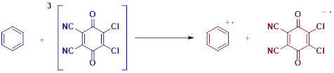
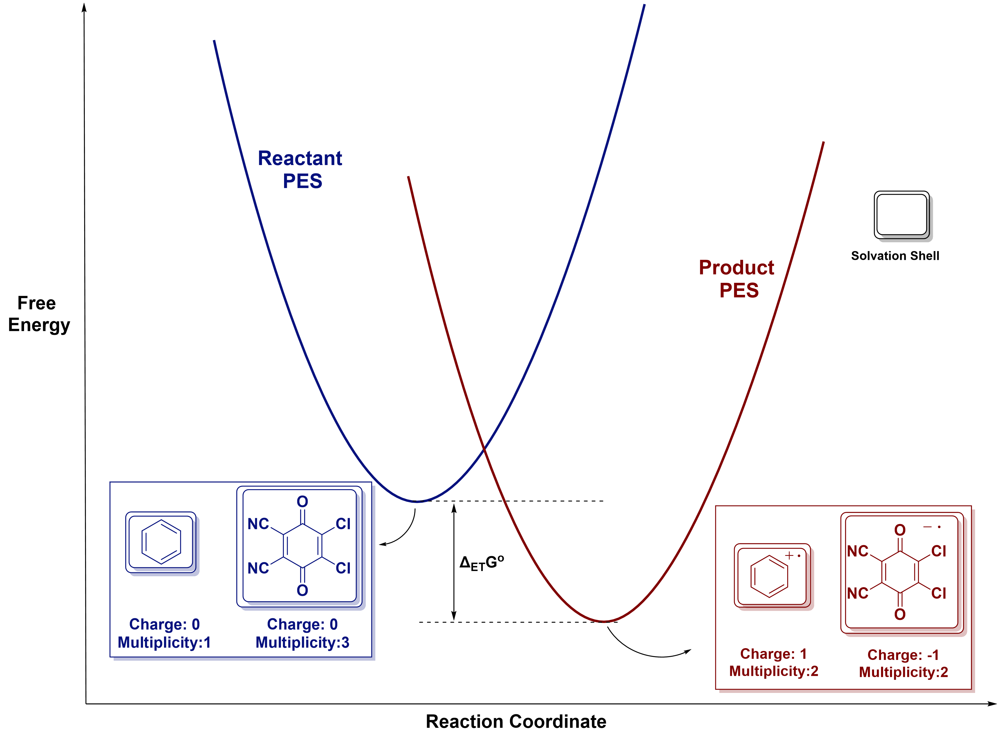
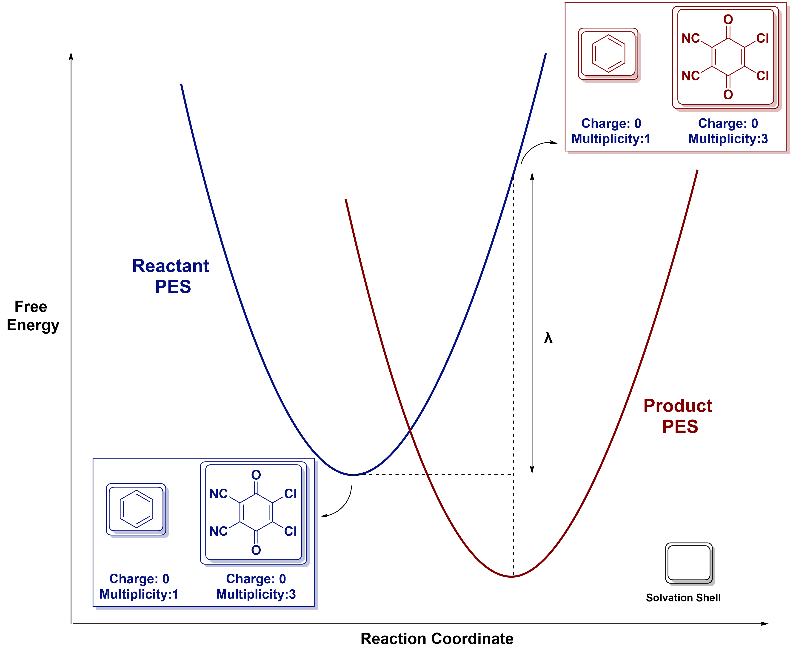
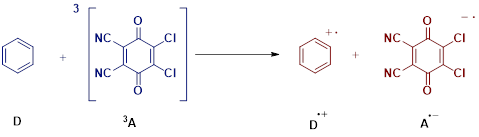

==================================================================
Calculating Electron-Transfer Barriers
==================================================================

1. Introduction
---------------

Here we describe the workflow for computing thermal activation barriers
for outer-sphere electron transfer (ET) processes using the Marcus–Hush model.
The procedure outlines how to obtain the free energy difference (:math:`\Delta G ^\circ`)
and reorganization energy (:math:`\lambda`) from density functional theory (DFT) calculations,
including the use of non-equilibrium solvation to calculate the solvent contributions.

2. Terminologies and Definitions
--------------------------------

:math:`\boldsymbol{\Delta G ^\circ}` **(Free Energy Difference):**
Gibbs free energy difference between reactant (pre-SET) and product (post-SET) states.

:math:`\boldsymbol{\lambda}` **(Reorganization Energy):**  
Sum of the energetic penalties associated with reorganizing. There are 
two types of reorganization energy:

- :math:`\lambda_i` : Internal geometry change  
- :math:`\lambda_{\circ}` : Solvent/environmental response

**Activation Barrier (Marcus)**  

:math:`\Delta G ^ \ddagger\ = \frac{(\lambda + \Delta G ^ \circ )^ 2}{4\lambda}`

**Non-Equilibrium Solvation**  
A solvation model in which the solvent polarization from one electronic state is
used to evaluate the energy of another state (using ``NonEq=Save`` / ``NonEq=Read``).

3. Brief Theory
---------------

Consider the example electron transfer (ET) between a triplet quinone
derivative (acceptor) and benzene (donor).

.. centered:: |scheme1| 

The :math:`\Delta G ^\circ` (free energy difference) between the reactant (before ET)
and product (after ET) states is the Gibbs free energy difference
between the optimized "bottom of the well" geometries of the structures.

.. centered:: |delta_G| 

The reorganization energy (:math:`\lambda`) can be visualized as the energy penalty to
take the reactant structures from their optimal geometry and solvation
shell to the geometry and solvation shell of the product, while maintaining
their initial electronic configuration.

.. centered:: |lambda_scheme| 

4. Procedure
------------

The Marcus–Hush calculation consists of three major steps:

1. Compute :math:`\Delta G ^\circ` from optimized reactant and product states.
2. Compute :math:`\lambda` using four single-point calculations (Nelsen's four-point method).
3. Calculate :math:`\Delta G ^\ddagger` using the Marcus equation.

Step 1: Compute Free Energy Difference (:math:`\Delta G ^\circ`)
~~~~~~~~~~~~~~~~~~~~~~~~~~~~~~~~~~~~~~~~~~~~~~~~~~~~~~~~~~~~~~~~

- Optimize the geometries of the reactant and product states separately.
- Extract the Gibbs free energies from each calculation.
- Compute:

:math:`\Delta G ^ \circ\ = G_{product} - G_{reactant}`

Step 2: Compute Reorganization Energy (:math:`\lambda`)
~~~~~~~~~~~~~~~~~~~~~~~~~~~~~~~~~~~~~~~~~~~~~~~~~~~~~~~

Reorganization energy is calculated using four single-point calculations:
two on reactant surfaces and two on product surfaces under non-equilibrium solvation.

Required Calculations
^^^^^^^^^^^^^^^^^^^^^

A. **Reactant-State Energies** (ordinary single points with equilibrium solvation)

- :math:`\boldsymbol{E_1}` : Donor (D) at its own optimized geometry and solvation  
  Charge/spin = reactant state

- :math:`\boldsymbol{E_2}` : Acceptor (A) at its own optimized geometry and solvation  
  Charge/spin = reactant state

B. **Product-State Geometries Using Reactant Electronic Configuration** (non-equilibrium solvation)

Each of these is a two-step job that shares one checkpoint file, and **both steps must be
at the same geometry**:

1. Run the *product* species (e.g. D⁺) at its own optimized geometry with
   ``SCRF=(...,NonEq=Save)``. This stores the equilibrium solvent polarization of the product.
2. In a linked job (``--Link1--``) at the same geometry (``Geom=Check Guess=Read``), change the
   charge/multiplicity to the reactant state and use ``SCRF=(...,NonEq=Read)``. The fast
   (electronic) part of the solvent responds to the new charge distribution, while the slow
   (orientational) part stays frozen from step 1.

- :math:`\boldsymbol{E_3}` : Donor (D) at the product (D⁺) optimized geometry, 
  reactant charge/multiplicity, ``NonEq=Read`` from the D⁺ ``NonEq=Save`` job

- :math:`\boldsymbol{E_4}` : Acceptor (A) at the product (A⁻) optimized geometry, 
  reactant charge/multiplicity, ``NonEq=Read`` from the A⁻ ``NonEq=Save`` job

A skeleton Gaussian input for :math:`\boldsymbol{E_3}` looks like this (the method and solvent
are placeholders; use the same ones as the rest of your study):

.. code:: none

    %chk=D_at_Dcation_geom.chk
    # M062X/def2TZVP SCRF=(IEFPCM,Solvent=Acetonitrile,NonEq=Save)

    D+ at its own geometry: save the equilibrium solvation

    1 2
    [D+ optimized coordinates]

    --Link1--
    %chk=D_at_Dcation_geom.chk
    # M062X/def2TZVP SCRF=(IEFPCM,Solvent=Acetonitrile,NonEq=Read) Geom=Check Guess=Read

    Neutral D at the D+ geometry, non-equilibrium solvation (E3)

    0 1

Computing :math:`\lambda`
^^^^^^^^^^^^^^^^^^^^^^^^^

:math:`\lambda = (\boldsymbol{E_3} - \boldsymbol{E_1}) + (\boldsymbol{E_4} - \boldsymbol{E_2})`

Forward and Reverse :math:`\lambda`
^^^^^^^^^^^^^^^^^^^^^^^^^^^^^^^^^^^

Compute :math:`\lambda` on both reactant and product surfaces.

The same four-point procedure applied to the reverse reaction
(product → reactant) gives :math:`\lambda_{reverse}`. In a harmonic model the two are equal;
in practice they often differ. In this workflow we combine them with the geometric mean:

:math:`\lambda_{eff} = \sqrt{\lambda_{forward} \times \lambda_{reverse}}`

.. note::

    Other choices (e.g. the arithmetic mean) are also used in the literature. Whichever you use,
    state it explicitly in your SI and apply it consistently. The four-point method itself is
    described by `Nelsen, Blackstock and Kim, J. Am. Chem. Soc. 1987, 109, 677
    <https://doi.org/10.1021/ja00237a007>`__.

Step 3: Calculate Activation Barrier (:math:`\Delta G ^ \ddagger`)
~~~~~~~~~~~~~~~~~~~~~~~~~~~~~~~~~~~~~~~~~~~~~~~~~~~~~~~~~~~~~~~~~~

Use the standard Marcus equation:

:math:`\Delta G ^ \ddagger\ = \frac{(\lambda + \Delta G ^ \circ )^ 2}{4\lambda}`

This value is used as the ET activation barrier. Keep all energies in the same units
(e.g. kcal/mol) before combining them. Note that :math:`\Delta G ^ \ddagger` has its minimum
(zero) when :math:`-\Delta G ^\circ = \lambda`; for more exergonic reactions
(:math:`-\Delta G ^\circ > \lambda`, the Marcus *inverted region*) the predicted barrier rises again.
For reactions between charged species, :math:`\Delta G ^\circ` should also include the
electrostatic work of bringing the reactants together (and separating the products).

The original theory is described in
`Marcus, J. Chem. Phys. 1956, 24, 966 <https://doi.org/10.1063/1.1742723>`__.

5. Example Workflow for :math:`\lambda` Calculation
---------------------------------------------------

We demonstrate the :math:`\lambda` calculation workflow using the example shown above.

.. centered:: |scheme2|

Four energies are required:

* :math:`\boldsymbol{E_1}`: Optimized D, charge 0, multiplicity 1
* :math:`\boldsymbol{E_2}`: Optimized 3A, charge 0, multiplicity 3
* :math:`\boldsymbol{E_3}`: Cation D⁺ geometry, but electronic configuration of D (charge 0, multiplicity 1); ``NonEq=Read`` (from saved solvation from D⁺)
* :math:`\boldsymbol{E_4}`: Anion A⁻ geometry, but electronic configuration of 3A (charge 0, multiplicity 3); ``NonEq=Read`` (from saved solvation from A⁻)

Compute :math:`\lambda` via:

:math:`\lambda = (\boldsymbol{E_3} - \boldsymbol{E_1}) + (\boldsymbol{E_4} - \boldsymbol{E_2})`

Repeat for product-state ET and take the geometric mean.

