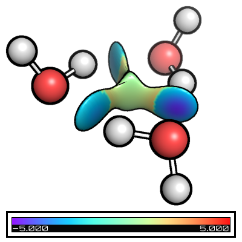
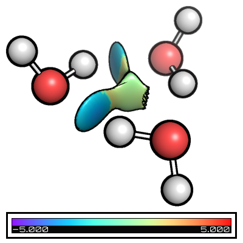
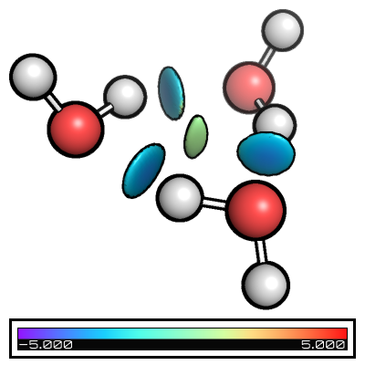
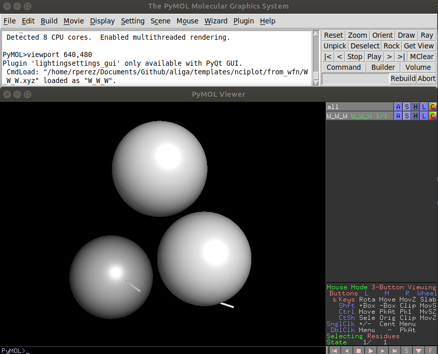
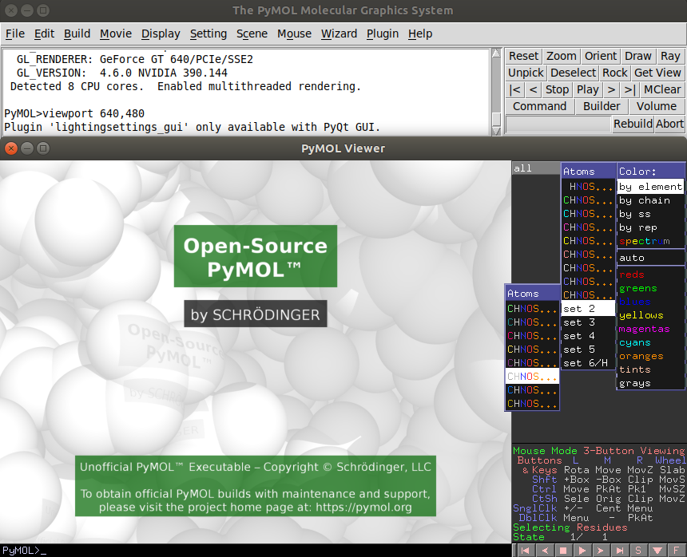
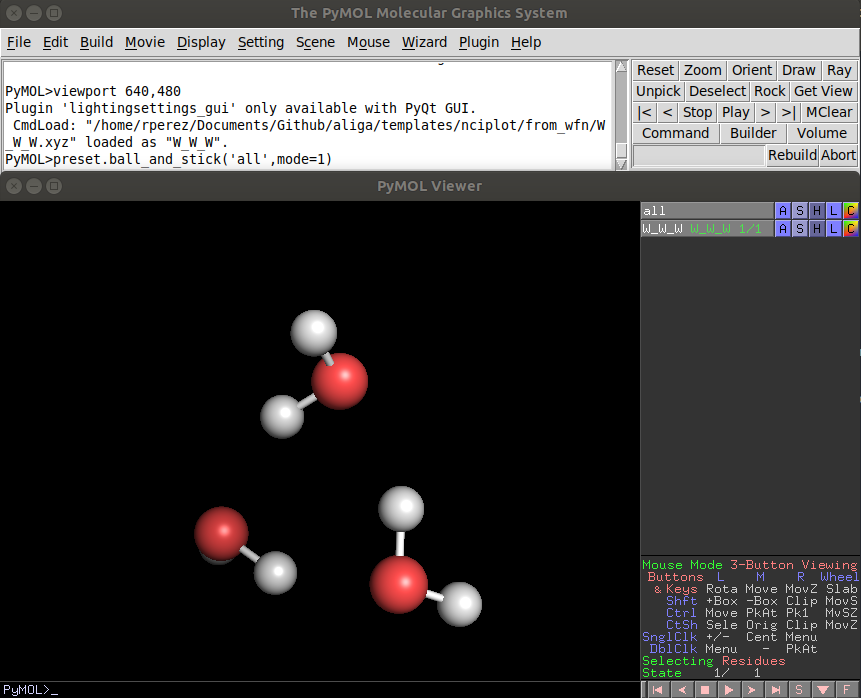
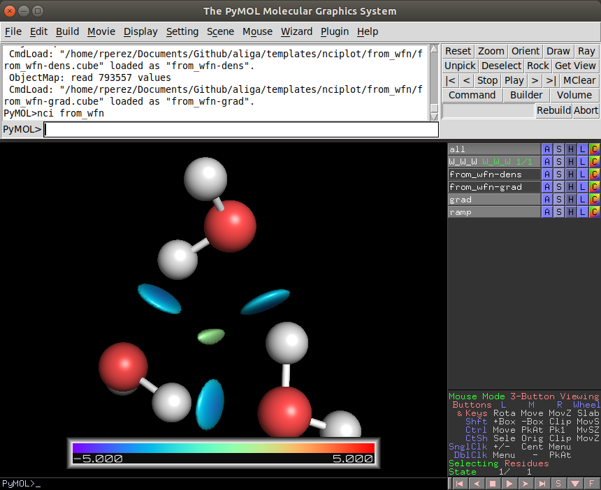

.. |from_wfn| image:: images/fig_from_wfn.png
   :width: 400
   :height: 400

.. |pymol_1| image:: images/pymol_welcome.png
   :width: 800
   :height: 600

===========================
NCIPLOT
===========================

This is a fast-usage guide for nciplot. For a detailed information on its usage
please check the guide of the version of nciplot that you are using. 

.. contents::
   :local:

Running the NCIPLOT calculation
-------------------------------

1. Prepare basic files
......................

For calculating the reduced gradient, nciplot requires some way of obtaining the
electronic density and its gradient. nciplot has some low level pre-computed 
atom-centered functions to derive them from pure xyz coordinates which is 
generally faster. A second option is to provide a wfn file. From gaussian we can
obtain it by adding the keyword `output=wfn` in the command line and specifying 
at the bottom of the input file the name of the file. 

Also we can divide our molecule in different fragments to check their 
interactions instead of all the interactions within the provided geometry. In 
those cases we need to divide our files into different files.

.. note::
   
   I recommend that per each nciplot you create a new folder. In that folder 
   you should place only the files needed for the nciplot program to run similar
   to the examples in this folder. NCIPlot generates several files and it makes
   everything easier to find when you want to generate nice figures.

if we want to use pure xyz
++++++++++++++++++++++++++

Per each fragment: 

*  Place the xyz file into the folder

if we want to use wfn
+++++++++++++++++++++

Per each fragment:

*  Place the xyz file into the folder (usefull for plotting not needed strictly) 
*  Create a gaussian input file with the output=wfn (SP works)
*  Run the gaussian calculation
*  Ensure a .wfn file has been created

2. Prepare the nci input file
.............................

You are more likely to need the NCIPLOT guide for this step if you want to do 
something fancy. Otherwise you can just copy one of the templates here and adapt
it to your files. 

.. highlight:: none

+-------------------------------------------------------------------------------------------------------------------------+
|                                                         Examples                                                        |
+============================================================+============================================================+
|                         **from_xyz**                       |                          **from_wfn**                      |
+------------------------------------------------------------+------------------------------------------------------------+
|        .. literalinclude:: resources/from_xyz.nci          |        .. literalinclude:: resources/from_wfn.nci          |
+------------------------------------------------------------+------------------------------------------------------------+
|                 **intermolecular_from_xyz**                |                  **intermolecular_from_wfn**               |
+------------------------------------------------------------+------------------------------------------------------------+
|  .. literalinclude:: resources/intermolecular_from_xyz.nci |  .. literalinclude:: resources/intermolecular_from_wfn.nci |
+------------------------------------------------------------+------------------------------------------------------------+

.. highlight:: default

3. Run nciplot
..............

In general you can run nciplot in your desktop computer without problems. Using 
xyz tends to be significantly faster than wfn files, but its theoretically less 
accurate. You can run it in the cluster though, The submit script is easy to 
create and it will be available in the templates/submit_jobs folder.

.. note:: 
   
   The qualitative picture its still the same, and until now I have not 
   ever seen anyone properly reporting how did they calculated the nciplot, if 
   it was from .xyz/.wfn I would only expect it to be relevant if you want to 
   do a numeric treatment of the results. 

.. code:: shell-session

   $ cd folder/where/my/files/are
   $ nciplot my_calculation.nci

nciplot will generate at least 4 files: 

*  my_calculation-dens.cube
*  my_calculation-grad.cube
*  my_calculation.dat
*  my_calculation.vmd

4. Plot the results
...................

A fast representation of the results can be obtained with vmd. That is the 
reason nciplot generates a .vmd file by default. To do so type: 

.. code:: shell-session

   vmd

Go to File, Load Visualization State, and select my_calculation.vmd. 

For fancier figures (Such as the ones in the examples) I do recommend using pymol.
See the "Plotting in Pymol" section for a fast guide to obtain a pretty figure.

5. Examples
...........

Folders *from_xyz*, *from_wfn*, *intermolecular_from_xyz*, and 
*intermolecular_from_wfn* contain the different basic files + nci input files
and you can see the its effect in the table below

+---------------------------------------------------------------------+
|                              Examples                               |
+=================================+===================================+
|          **from_xyz**           |              **from_wfn**         |
+---------------------------------+-----------------------------------+
|           |from_xyz|            |               |from_wfn|          |
+---------------------------------+-----------------------------------+
|   **intermolecular_from_xyz**   |    **intermolecular_from_wfn**    |
+---------------------------------+-----------------------------------+
|          |from_ixyz|            |               |from_iwfn|         |
+---------------------------------+-----------------------------------+

Plotting in Pymol
-----------------

Here you will find a fast way of generating images of the NCI such as the ones 
displayed using pymol. This software is available in two versions, the source 
code which is open sorce and the precompiled which is usually associated with 
the Schroedinger software (Macromodel, Jaguar, Maestro ... etc) 

1. Prepare the files
....................

If you have followed the advice of the previous guide you will have most of the 
files needed. Please copy the pynci.py file in this repo to the appropiate place. 
That file was obtained from the developers of NCIPLOT and is shown here: 

.. code:: python 

   #
   # nci.py, a tiny script to display plots from Nciplot in PyMOL
   #
   #get Nciplot at http://gatsby.ucmerced.edu/wiki/Nciplot
   #
   #Nciplot references:
   #
   # J. Contreras-Garcia, E. Johnson, S. Keinan, R. Chaudret, J-P Piquemal, D. Beratan, W. Yang, J. Chem. Theor. Comp. 7, 625 (2011).
   # E R. Johnson, S. Keinan, P. Mori-Sanchez, J. Contreras-Garcia, A J. Cohen, and W. Yang, J. Am. Chem. Soc., 132, 6498 (2010).
   #
   #
   #Usage:
   #
   #Load the molecular geometry and the two cube files (-grad and -dens) into pymol
   #
   #load the script in pymol (for instance, using file->run and selecting the nci.py from the PyMOL GUI)
   #
   #Run the script by typing:   nci  basename
   #in pymol, where basename is the first part, before the dash, of the name of the cube files (i.e. basename-dens.cube)

   #
   #This python script is in the public domain.
   #

   from pymol import cmd, stored
   
   def nci( arg1 ):
      densf=arg1+"-dens"
      gradf=arg1+"-grad"
   #  gdens=open(densf+".cube","r")
   #  grad=open(gradf+".cube","r")
      cmd.isosurface("grad",gradf, 0.5)
      cmd.ramp_new("ramp", densf, [-5,5], "rainbow")
      cmd.set("surface_color", "ramp", "grad")
      cmd.set('two_sided_lighting',value=1)
   
   cmd.extend( "nci", nci )

Although that's the version provided by NCIPLOT developers, I do recommend this 
custom version instead: 

.. code:: python 

   from pymol import cmd, stored
   
   def nci( filename, isovalue=0.5, cmin=-5.0, cmax=5.0, palette='[blue, white, red]'):
      densf = f'{filename}-dens'
      gradf = f'{filename}-grad'

      lims = (cmin,cmax)

      cmd.isosurface("grad",gradf, isovalue)
      cmd.ramp_new(ramp, densf, lims, palette)
      cmd.set("surface_color", "ramp", "grad")
      cmd.set('two_sided_lighting',value=1)
   
   cmd.extend( "nci", nci )

.. tip:: 
   
   A quick note about bonds. Bonds in .xyz files will tend to appear always 
   as single bonds. If you want your aldehyde to show properly the two bonds, 
   convert the .xyz file to a .sdf file, and open that file instead.
   To do the conversion you can use openbabel: :code:`obabel -ixyz my_calculation.xyz -osdf -O my_calculation.sdf`

So at this point you should have the following files in your folder: 

*  my_calculation-dens.cube
*  my_calculation-grad.cube
*  my_calculation.xyz
*  pynci.py (the following tutorial figures will assume the NCIPLOT's developer version)
*  (optional) my_calculation.sdf

.. note:: 

   If you used different fragments you will have different .xyz and .sdf also.

2. Starting Pymol
.................

If you have pymol properly installed you should be able to just run the "pymol" 
command in the console. Otherwise you should look for the executable and either 
use it from command line or double click it. 

As you open pymol and you will see something like the following image: 

|pymol_1|

pymol has two windows and two consoles. I generally prefer to type in the top 
one and leave the bottom one only for visualizing, changing the view and 
selecting atoms, but you can use both consoles equally. 

type the following code: 

.. code:: shell-session

   PyMOL> run path/to/pynci.py

if you opened pymol in the same folder that you have everything you can just 
type "run pynci.py"

3. Loading the geometry
.......................

Now go to File -> Open... and select the files with the geometries. This is when 
you choose either to load the .xyz or the .sdf 

After that, unless you have the defaults changed, you will see a horrible version
of your molecule. 

|pymol_2|

Do not worry, we will make it pretty. 

4. Start making things pretty
.............................

If you are picky with the colors like me, you are not gonna like the default 
colors. If that is the case go to the rainbow "C" on the rightmost part of the 
fragment and choose the colorset that suits you the best. I generally pick the 
one in the following image. 

|pymol_3|

Before we plot the nciplot I do recommend to play with the representation of 
the molecules to suit your tastes. It is really easy to google the stuff and the
pymol wiki is very complete and with pictures.

A fast way of getting the ball and stick representation is to type in the pymol 
console: 

.. code:: shell-session

   PyMOL> preset.ball_and_stick('all',mode=1)

|pymol_4|

5. Loading the density and gradient
...................................

To plot the NCI pymol will need both .cube files. Proceed as you did with the 
.xyz and/or .sdf and load my_calculation-dens.cube and my_calculation-grad.cube

6. plotting the NCI
...................

Now it is just as easy as running the following command in the pymol console: 

.. code:: shell-session

   PyMOL> nci my_calculation

.. note::

   Please, remember to substitute "my_calculation" by the name of your 
   calculation

With this, two new items will appear: "ramp" (color legend) and "grad" (nci). 
Great if you like how you see it you are ready to go.

|pymol_5|

7. Basics of visualization
..........................

*  **Zoom out**: press the right mouse button and move it towards you.
*  **Zoom in**: press the right mouse button and move it away from you.
*  **Rotate view**: press the left mouse button and move it. 
*  **Camera distance**: Sometimes you will see that the atoms are cut, you can 
   generally solve it using the mouse wheel.
*  **Move view**: To move without rotation click the mouse wheel and move the mouse accordingly

Those are the basics, if you want more please look into the documentation it is 
really good. 

8. Generating a nice image
..........................

To end up with the result that you saw in the examples you need a finer control,
but you can get nice looking pictures without such effort. To do so we run the 
following commands in the pymol console: 

.. code:: shell-session

   PyMOL> set opaque_background, 0
   PyMOL> set ray_trace_mode, 1
   PyMOL> ray 600,600

.. note:: 

   The 600,600 correspond to width and height respectively in pixels. For a 
   bigger quality and size, just increase the numbers. 

Then we go to File -> Export Image As... -> PNG...
We name the file and done! 

9. Generating image layers for composition
..........................................

To end up with the result that you saw in the examples I overlayed 
different images with GIMP, that allows us to get a finer control. I generally 
add manualy the color of the background (if I add it) in GIMP.

To generate the different layers we are gonna play with what we can see in the 
screen at any given time. To enable/disable the view of an element (let's say 
the "ramp" for example) we just have to click on it on the rightmost pannel. 

With that and changing the ray_trace_mode we can obtain different layers: 

*  **ray_trace_mode=0** will render without contourn
*  **ray_trace_mode=2** will render only the contourn
*  **ray_trace_gain=1.0** will change the width of the contourn when rendering in mode=2

You can also change the transparency of the surface and everything, but it is much 
easier to do so in GIMP. 

Composing in GIMP is out of the scope of this fast guide
but overall you will have to open as layers all the different snapshots that you took
order them accordingly, maybe invert the colors of the contourn and finally export 
as an image the result. 

