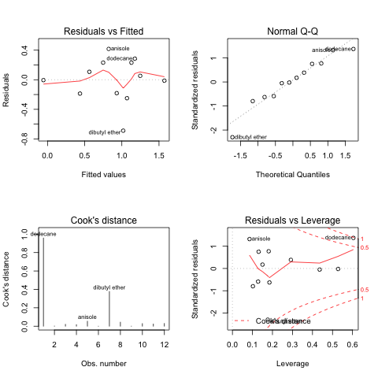

.. |REGGAE-MV-linear-plot| image:: images/REGGAE-MV-linear-plot.png
.. |REGGAE-correlation-plot| image:: images/REGGAE-correlation-plot.png

.. |PCA-clusters-REGGAE| image:: images/PCA-clusters-REGGAE.png

==========================
Example REGGAE Workflow 
==========================

.. contents::
    :local:

Installation
-------------

1. Clone REGGAE from GitHub. Here is the `REGGAE GitHub Page <https://github.com/Liliana-Gallegos/REGGAE/>`_

.. code:: shell

    git clone https://github.com/Liliana-Gallegos/REGGAE.git
    

2. Create a new conda environment with all the r-essentials conda packages built from CRAN:

.. code:: shell

    conda create -n r_env r-essentials r-base
   
3. Activate the r_env:

.. code:: shell

    conda activate r_env

Note: To list the r packages already installed in r_env use ``conda list``
   
4. Install all packages required for REGGAE with conda:

.. code:: shell

    conda install --yes --file requirements.txt

Note: Maybe need to install using older version of python. Add ``python=3.9``
   
5. Confirm by running REGGAE help options:

.. code:: shell

    Rscript reggae.r -h

.. warning:: 
    With error: could not find function "all_of", then run setup_for_allof.r script
    using ``Rscript setup_for_allof.r``

Example 1: Performing a multivariate regression 
-----------------------------------------------

Using (i) Forward-stepwise feature selection and (ii) Random 70 Train and 30 Test split on a 
dataset containg 20 samples and 17 features.

.. code:: shell

    Rscript reggae.r -i 20solvents.csv -y Exp_dG -m stepwise -r 0.7

.. note::
    Other feature selection ``-m`` options are available. 

.. warning:: 
    Dredge option takes time and therefore should be executed with small number of features. 

First portion of the Terminal output (without using the verbose option) includes the split performed, 
regression formula in both scaled and nonscaled versions, and the R2 and RMSE values.

.. highlight:: none

.. literalinclude:: resources/terminal_outputs.txt 
    :start-after: example1-start
    :end-before: example1-end 

.. highlight:: default

Example 2: Performing a multivariate regression
-----------------------------------------------

Using (i) manual feature selection, (ii) predefined split selection, and (iii) cross-validation.
The split has been defined as Train and Test within the 12kclusters column in the dataset. 
Therefore, the script will pick up the column with two catagorical variables. 
To execute this option, ``-r`` is set to 0.

.. code:: shell

    Rscript reggae.r -i 20solvents.csv -y Exp_dG -b Sig2,V -r 0 -q -v

.. note:: 
    Error can occur if there are multiple columns with strings or characters.  

First portion of the Terminal output (without using the verbose option) includes the split performed, 
regression formula in both scaled and nonscaled versions, R2 and RMSE values, 
and three cross validation analysis: Leave-one-out, K-fold (k=5), and Q2.

.. highlight:: none

.. literalinclude:: resources/terminal_outputs.txt 
    :start-after: example2-start
    :end-before: example2-end

.. highlight:: default

Using the ``-v`` option prints out the following Terminal output: preview of the scaled values, 
ANOVA analysis, regression plot (.png), a table of predicted y-values.

.. highlight:: none

.. literalinclude:: resources/terminal_outputs.txt 
    :start-after: example2v-start
    :end-before: example2v-end

.. highlight:: default

Continued Terminal output includes analysis for the three cross-validation methods.

.. highlight:: none

.. literalinclude:: resources/terminal_outputs.txt 
    :start-after: example2cv-start
    :end-before: example2cv-end

.. highlight:: default

Regression Plot Generated
-------------------------

From Example2: Regression plot is saved in working folder as REGGAE-MV-linear-plot.png.

.. centered:: |REGGAE-MV-linear-plot|

Pearson Correlation Plot  
------------------------

Adding the ``-c 0.5`` option outputs: pairwise correlations between features > 0.5 

.. highlight:: none

.. literalinclude:: resources/terminal_outputs.txt 
    :start-after: pcorrelation-start
    :end-before: pcorrelation-end

.. highlight:: default

Using the ``-v`` option saves the plot within the working folder as REGGAE-correlation-plot.png.

.. centered:: |REGGAE-correlation-plot|

Diagnostics Plot
----------------

Adding the ``-d`` option outputs: QSAR analysis for the Test set and collinearity analysis in the first section (withou ``-v`` option).

.. highlight:: none

.. literalinclude:: resources/terminal_outputs.txt 
    :start-after: diagnostics-start
    :end-before: diagnostics-end

.. highlight:: default

Using the ``-v`` option saves the plot within the working folder as REGGAE-diagnostics-plot.png.

.. centered:: |REGGAE-diagnostics-plot|

PCA Plot
--------

Using the ``-p 5,2`` option requests running principal componenet analysis with k-means clustering using 5 clusters and 2 components. 
Using the ``-v`` option gives the PCA-clusters and Scree plots (or elbow plots) for each the clusters and components. 
Also, within the terminal output, the script returns the loadings. 
Showing only the PCA clustering plot.

.. centered:: |PCA-clusters-REGGAE|
